# CI/CD and Kubernetes — A Detailed AWS, Azure, TeamCity and Jenkins Guide

**GitHub learning edition · 7 October 2026 · Original research: 16–17 September 2026**

For an experienced Java/backend engineer who wants simple explanations first and senior-level depth afterward. Examples use a fictional internal assistant named Atlas. Workload numbers are teaching assumptions unless explicitly attributed.

**Reading path:** Start with B1–B9 to understand the parts. Continue with reference chapters 1–29 for Kubernetes details, cloud messages, identity exchanges, scripts and troubleshooting.

**How each explanation works:** understand the job, identify the subparts, follow concrete input/output, inspect a failure, then choose the implementation. The scope is the complete learning path described in the contents; vendor APIs and every possible product option are not exhaustive.

**Diagrams and code:** Mermaid diagrams are embedded directly in this Markdown. PNG/SVG images and companion files are included in this directory. Clone or download the repository to preserve relative image/code paths. The matching HTML edition embeds its illustrations for offline reading. Framework/cloud snippets state their prerequisites, and live deployments were not executed. See [validation status](VALIDATION.md).

**Version refresh (7 October 2026):** Spring AI documentation still lists 2.0.1 and Boot 4.0.x/4.1.x compatibility; MCP latest resolves to 2026-07-28, and the official Python SDK documents its v2 API. Other provider details retain their original research date; this is not a claim of a full dependency or security audit. See [source index](SOURCES.md).

## Contents

- [B1. What happens after you push a Java change?](#section-01)
- [B2. Containers: image, process, filesystem and registry](#section-02)
- [B3. Kubernetes components explained as a coordinated backend system](#section-03)
- [B4. Pod, Service, EndpointSlice and ingress: follow an actual request](#section-04)
- [B5. Resources, probes and shutdown with numbers](#section-05)
- [B6. Persistent data, configuration changes and recovery](#section-06)
- [B7. AWS and Azure connectivity made intuitive before the wire details](#section-07)
- [B8. TeamCity, Jenkins and alternatives: reason about ownership](#section-08)
- [B9. Glossary and a complete failure drill](#section-09)
- [1. The system we will build and operate](#section-10)
- [2. CI, delivery, deployment and GitOps are different responsibilities](#section-11)
- [3. Containers: what actually gets packaged](#section-12)
- [4. Kubernetes internals through a deployment trace](#section-13)
- [5. Scheduling and resource math](#section-14)
- [6. Networking: follow one request](#section-15)
- [7. Health checks, shutdown and rolling updates](#section-16)
- [8. Autoscaling with queueing theory](#section-17)
- [9. Configuration, identity and persistent state](#section-18)
- [10. GitOps, canaries and recovery](#section-19)
- [11. AWS, Azure, GCP and independent alternatives](#section-20)
- [12. Hands-on progression and interview reasoning](#section-21)
- [13. Configuration packaging: Helm, Kustomize and rendered evidence](#section-22)
- [14. Narrow permissions for a live deployment-status tool](#section-23)
- [15. The complete delivery connection model](#section-24)
- [16. From Git commit to an authorized build](#section-25)
- [17. AWS identity: credential provider chains and STS](#section-26)
- [18. AWS request signing, ECR and registry messages](#section-27)
- [19. EKS connectivity: discovery, authentication and authorization](#section-28)
- [20. Azure identity: managed identity and workload federation](#section-29)
- [21. ACR: Entra authentication becomes registry authorization](#section-30)
- [22. AKS: ARM discovery, kubelogin and cluster authorization](#section-31)
- [23. Network connectivity: private does not mean automatically reachable](#section-32)
- [24. TeamCity: controller settings, agents, build chains and messages](#section-33)
- [25. Jenkins: controller, agents, credentials and the Jenkinsfile](#section-34)
- [26. Practical publisher/deployer scripts and their contracts](#section-35)
- [27. Alternatives with concrete integration choices](#section-36)
- [28. Troubleshooting workbook: reason from the failed boundary](#section-37)
- [29. Under the agent connection: TCP, TLS, polling and Remoting](#section-38)

---

<a id="section-01"></a>

## B1. What happens after you push a Java change?

Suppose you change the Atlas Spring Boot API to improve citation validation. You want the tested change running in staging and, after approval, production. The problem is not simply copying a JAR to a server. You need to prove which source produced the JAR, which checks passed, what configuration accompanies it, who may deploy it, and how to recover if it fails.

**Continuous integration** checks that a change integrates with the codebase. **Continuous delivery** keeps a releasable result ready for promotion. **Continuous deployment** automatically promotes eligible changes according to policy. A team can practice CI and delivery while retaining a human production approval.

### B1.1 Follow one immutable release

| Stage | Concrete input | Work performed | Concrete output |
|---|---|---|---|
| Checkout | Approved commit SHA | Fetch exact source and build configuration | Workspace at known revision |
| Resolve | Build descriptors and lock/BOM policy | Obtain dependencies from approved sources | Dependency graph |
| Compile/test | Source plus dependencies | Build and verify specified contracts | JAR, reports, failures |
| Package | JAR and runtime recipe | Build container image | Image manifest and layers |
| Publish | Candidate image | Upload to ECR/ACR or another registry | Immutable digest reference |
| Stage | Digest and environment configuration | Update the staging workload | Observed running revision |
| Evaluate | Staging endpoints and test dataset | Smoke, integration, load and AI quality checks | Evidence tied to this release |
| Promote | Approved release record | Select the same artifact for production | Audited desired-state change |
| Observe | Metrics, traces and user outcomes | Detect regression and decide recovery | Accepted release or recovery action |

A source SHA identifies source content. An image digest identifies built image content. A deployment revision identifies a workload configuration change. They are related, but not identical. Rebuilding the same commit later can produce a different image if dependencies, base images or build inputs changed. That is why promotion normally moves a tested artifact rather than rebuilding it for each environment.

### B1.2 Why pipeline stages need boundaries

An untrusted pull request must not receive the same identity as a production release job. Tests execute repository code; malicious code can read environment variables, files and accessible metadata endpoints. Secret masking in logs does not make that code trustworthy. Use isolated runners and grant short-lived release identity only to approved code/settings paths.

Keep a release record containing source SHA, image digest, relevant configuration/prompt/index versions and evaluation results. The advanced chapters show the AWS/Azure exchanges that establish publishing and deployment identities. Those exchanges happen after the CI system decides that the job is eligible for privileges.

<a id="section-02"></a>

## B2. Containers: image, process, filesystem and registry

### B2.1 An image is a recipe result; a container is a running process environment

An image includes filesystem layers and metadata such as entry point, command, environment defaults and working directory. Starting a container creates a process with that filesystem view and configured isolation/resource boundaries. A stopped image in a registry consumes storage; it does not run your application.

Linux namespaces isolate views of resources such as processes and networking; cgroups account for and constrain resource use. Containers usually share the host kernel. They are not automatically equivalent to separate virtual machines. Runtime permissions, kernel exposure, mounted sockets and capabilities matter. Mounting the host Docker socket into a build is a powerful privilege, not merely a convenient filesystem mount.

### B2.2 Why multi-stage builds matter

The build stage can contain Maven, a JDK and source files. The final stage needs only the selected runtime and application artifacts. This reduces unnecessary content in the delivered image and separates build tooling from runtime dependencies. It does not, by itself, prove the image is secure or reproducible. [Docker multi-stage builds](https://docs.docker.com/build/building/multi-stage/).

```dockerfile
# Illustrative recipe. Pin reviewed image digests in an actual release build.
FROM maven:3.9-eclipse-temurin-21 AS build
WORKDIR /src
COPY pom.xml .
COPY src ./src
RUN mvn -B -ntp verify

FROM eclipse-temurin:21-jre
WORKDIR /app
COPY --from=build /src/target/app.jar /app/app.jar
USER 10001:10001
ENTRYPOINT ["java", "-jar", "/app/app.jar"]
```

This teaching recipe assumes Maven is configured to produce `target/app.jar`; the companion Spring project has its own matching Dockerfile. The final user ID requires filesystem permissions compatible with the application. A non-root user still needs a writable temporary directory if libraries write temporary files. Test the actual runtime behavior rather than assuming `USER` alone completes hardening.

### B2.3 Layers, manifests, tags and digests

Layers are content-addressed filesystem changes. A manifest describes which layers and configuration form an image. A tag such as `atlas:staging` is a mutable name unless policy prevents changes. A digest identifies particular bytes. A multi-platform image index can point to different platform-specific manifests; an ARM laptop build is not necessarily runnable on an x86 cluster.

The registry can avoid re-uploading an existing blob by checking its digest. Publishing the manifest makes the assembled image reference available after its referenced data is uploaded. The advanced ECR/ACR chapters show the actual HTTPS registry operations. Retention policy must preserve every digest that a current deployment or recovery plan might need.

### B2.4 Configuration belongs to a release, but secrets should not be baked into an image

The same image can run in staging and production with different configuration. An environment variable is one delivery mechanism, not a security classification. A model API key in an image layer remains recoverable even if a later build step deletes the file. Use the runtime's approved identity/secret mechanism and prevent credentials from entering the build context, logs or artifacts.

<a id="section-03"></a>

## B3. Kubernetes components explained as a coordinated backend system

Kubernetes stores desired state and runs controllers that work toward it. A controller repeatedly compares what should exist with what it observes, then makes corrective API changes. This is called **reconciliation**. It is not one synchronous deployment function that completes every operation before returning.

### B3.1 Component responsibilities

| Component | Simple job | Important input/output | Failure symptom to recognize |
|---|---|---|---|
| API server | Validated entry point for cluster state | Authenticated requests, admission decisions, persisted objects | API requests fail or become slow |
| etcd | Durable control-plane key/value store | Cluster configuration/state records | Control-plane state operations lose availability or lag |
| Deployment controller | Manages rollout intent through ReplicaSets | Deployment specification to ReplicaSet changes | Desired version does not progress |
| ReplicaSet controller | Maintains the requested number of Pods | Replica count to Pod creation/deletion | Missing replicas are not replaced |
| Scheduler | Selects a suitable node for an unscheduled Pod | Resource/placement constraints to node assignment | Pod stays Pending with scheduling events |
| Kubelet | Realizes assigned Pods on one node | Pod spec to runtime operations and status | Node/Pod startup or health problems |
| Container runtime | Pulls/unpacks images and runs containers | Runtime requests to processes | Image pull, sandbox or process-start failures |
| Cluster network implementation | Provides Pod networking and policy behavior | Addresses, routes and policy | Pods cannot communicate as expected |
| Service data plane | Routes Service traffic to eligible endpoints | Service/EndpointSlice state to forwarding rules | Service fails while direct Pod access works |
| DNS service | Resolves cluster names | Service names to addresses | Name lookup fails before TCP connection |
| Storage integration | Provisions/attaches/mounts storage | Claims and volume requests to storage operations | Pending volume or mount errors |

These are logical roles; some are packaged together, and managed Kubernetes hides some operations from you. Service forwarding may use kube-proxy or an alternative implementation. Consult the actual cluster network/runtime, not a diagram that assumes one implementation everywhere. [Kubernetes component overview](https://kubernetes.io/docs/concepts/overview/components/).

### B3.2 Authentication, authorization and admission are three checks

**Authentication** answers “who submitted this request?” **Authorization** answers “may this identity perform this verb on this resource?” **Admission** can validate or modify an otherwise authorized object before persistence, according to configured policy. For example, your deployer may be permitted to patch a Deployment, but admission may reject an unapproved image registry or a privileged container.

This distinction explains three different failures: an invalid token can cause authentication failure; a valid token with insufficient namespace rights can cause a forbidden response; a permitted operation can still be rejected because the proposed object violates policy. Adding a broad cloud role does not necessarily fix any of those cluster-local decisions.

### B3.3 The desired-state trace for three replicas

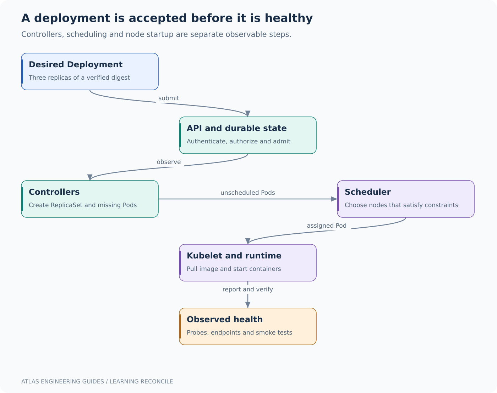

1. You submit a Deployment asking for three replicas of digest D.
2. The API server validates the request through the configured security/admission path and persists the object.
3. The Deployment controller observes the object and creates/updates the corresponding ReplicaSet.
4. The ReplicaSet controller creates missing Pod objects.
5. The scheduler selects nodes satisfying each Pod's requirements and records assignments.
6. Each selected node's kubelet asks its runtime to realize the Pod, including image access and container startup.
7. Status and probe results flow back into cluster state; routing components observe eligible endpoints.
8. The rollout observer checks progress. The application smoke test checks that users can actually use the service.

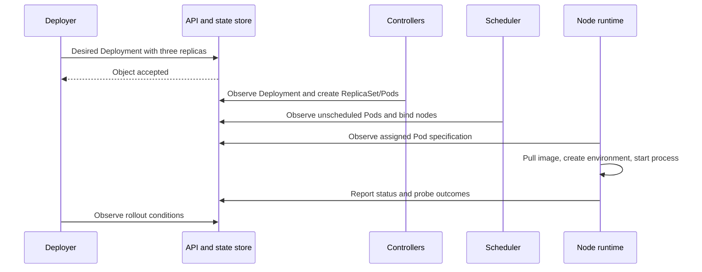
```mermaid
sequenceDiagram
    participant D as Deployer
    participant A as API and state store
    participant C as Controllers
    participant S as Scheduler
    participant N as Node runtime
    D->>A: Desired Deployment with three replicas
    A-->>D: Object accepted
    C->>A: Observe Deployment and create ReplicaSet/Pods
    S->>A: Observe unscheduled Pods and bind nodes
    N->>A: Observe assigned Pod specification
    N->>N: Pull image, create environment, start process
    N->>A: Report status and probe outcomes
    D->>A: Observe rollout conditions
```

An accepted API request precedes a healthy rollout. If registry access fails, the desired state remains valid while realization is blocked. Reading events/status tells you where progress stopped; repeatedly applying the same YAML does not repair a missing registry permission.

### B3.4 Controllers, operators and custom resources

A custom resource adds an application-specific API object, such as a database cluster description. A controller/operator implements behavior around that object. The custom resource definition alone does not create a functioning database operator. You also need running controller code, permissions, reconciliation logic and recovery procedures. [Kubernetes custom resources](https://kubernetes.io/docs/concepts/extend-kubernetes/api-extension/custom-resources/).

For an AI platform, an operator might manage model deployments or index jobs. Introduce one only if declarative lifecycle management pays for the additional controller maintenance. A normal Deployment plus Job may be simpler for the first implementation.

<a id="section-04"></a>

## B4. Pod, Service, EndpointSlice and ingress: follow an actual request

### B4.1 Pod versus container

A Pod is a scheduling/lifecycle unit that can contain cooperating containers. Containers in a Pod share its network context, so one can reach another on localhost. Containers in different Pods cannot use localhost to reach each other. A Pod IP can change when the Pod is replaced; application discovery should not depend on a permanently remembered Pod IP.

An init container completes setup before application containers proceed according to the configured lifecycle. A sidecar runs alongside the application for a supporting role such as a proxy. More containers mean more resource requests, failure paths and shutdown ordering to understand. Do not add a sidecar merely because a reference diagram has one.

### B4.2 Service and EndpointSlice

A Service provides stable discovery/routing configuration for a changing backend set. A selector matches labels; EndpointSlices represent the actual endpoint addresses and conditions. A selector typo can create a Service object with no useful endpoints. The DNS name may resolve correctly even though there is nowhere healthy to route.

Endpoint conditions distinguish readiness, serving and termination. EndpointSlice data helps implementations handle draining; actual forwarding behavior depends on the Service/proxy configuration. Do not assume deleting a Pod instantaneously removes every existing connection. [EndpointSlice conditions](https://kubernetes.io/docs/concepts/services-networking/endpoint-slices/).

**Worked path:** `atlas-api.atlas.svc` resolves to the Service address in a typical ClusterIP setup. The selected data plane forwards the connection to a ready backend, perhaps `10.2.4.17:8080`. If that Pod is replaced, the endpoint set changes while the Service name remains stable. A gateway may route directly to discovered endpoints instead of literally hopping through a Service IP; distinguish logical configuration from packet hops.

### B4.3 Ingress/Gateway and network policy

The edge proxy can terminate TLS and route by hostname/path. A Service usually addresses backend selection inside the cluster. NetworkPolicy controls allowed traffic only when enforced by a compatible network implementation. None of these automatically verifies an application's user JWT.

Use the right layer for each question: DNS resolves names, routing finds a path, TLS verifies/protects the connection, network policy restricts traffic, and the application enforces user/resource authorization. A successful TCP connection proves no permission to read customer data.

### B4.4 Troubleshoot from narrow observations

| Observation | Next evidence to inspect | Avoid this premature conclusion |
|---|---|---|
| Name cannot resolve | DNS configuration and query result from the workload network | “The application is down” |
| DNS works, TCP times out | Routes, firewall/security groups, NetworkPolicy, endpoint address | “The JWT is wrong” |
| TLS certificate error | Hostname, CA trust, expiry, termination point | “Disable verification” |
| HTTP 401 | Token validity and expected identity mechanism | “Scale more Pods” |
| HTTP 403 | Expected principal and resource permission | “Networking is blocked” |
| 503 from gateway | Ready endpoints, upstream connection, application health | “The image push failed” |
| Stream starts then stops | Idle/overall timeouts, buffering, cancellation | “HTTP 200 proves completion” |

<a id="section-05"></a>

## B5. Resources, probes and shutdown with numbers

### B5.1 Requests and limits answer different questions

A resource request helps scheduling and resource accounting. A limit constrains usage through the relevant enforcement mechanism. CPU and memory behave differently: CPU limits can lead to throttling; memory exhaustion can lead to termination. A low average CPU metric does not prove enough memory or provider quota.

Suppose a node has 6 allocatable CPU cores and 12 GiB allocatable memory after reservations. An API Pod requests 0.5 CPU and 1.5 GiB. CPU alone suggests twelve Pods; memory suggests eight. Eight is the tighter bound before other placement constraints. If each Pod also includes a sidecar requesting 0.1 CPU and 0.5 GiB, totals become 0.6 CPU and 2 GiB; memory now limits the node to six such Pods. Count the entire Pod, not only the main container.

For Java, heap is only part of process memory. Metaspace, thread stacks, direct buffers, native libraries and other overhead also consume memory. A heap equal to the container memory limit leaves no room for those parts. Load-test the actual process and inspect memory categories before choosing limits.

### B5.2 Startup, readiness and liveness

Startup probes allow a configured startup period before normal probe behavior takes over. Readiness asks whether the Pod should receive relevant traffic. Liveness asks whether restarting the container is an appropriate recovery action. A slow upstream model should not automatically make every API instance fail liveness and restart simultaneously.

For a model-backed API, readiness might depend on local initialization and required configuration while a provider outage produces controlled request errors. Whether dependency health should remove the instance from traffic depends on whether another instance can do better. If every instance depends on the same unavailable provider, removing all endpoints can hide the useful application error contract behind a generic proxy failure.

### B5.3 A shutdown timeline

Assume a 40-second termination grace period and up to 25 seconds for an accepted stream to finish. On termination, stop admitting new work, propagate readiness/draining state, allow bounded in-flight completion, close resources and exit before forceful termination. A pre-stop hook consumes time from the overall termination budget; it is not an extra unlimited period.

Endpoint updates, proxy observations and process signals are not one atomic operation. Existing connections may continue while new routing state propagates. Test a rolling update with real streaming clients and a deliberately slow request. A fixed sleep alone does not prove graceful shutdown under load.

### B5.4 Scaling can multiply a bottleneck

Ten replicas with a local model-concurrency cap of four can produce forty simultaneous model calls. Scaling to thirty replicas can produce 120 calls while the upstream quota is unchanged. The remedy may be a fleet-level budget and bounded queue, not more replicas. Likewise, twenty Pods each opening thirty database connections can demand 600 sessions.

Separate request capacity from upstream capacity. Track queue wait, rejected requests, active model calls, provider throttles, output-token rate and database-pool wait. CPU-based HPA alone often misses I/O-bound saturation.

<a id="section-06"></a>

## B6. Persistent data, configuration changes and recovery

### B6.1 PV, PVC, StorageClass and CSI

A PersistentVolumeClaim expresses a workload's storage request. A PersistentVolume represents storage available/bound to that request. A StorageClass describes provisioning behavior; a CSI driver connects Kubernetes to the storage implementation. The storage's topology, access modes and attachment constraints still apply. [Persistent-volume concepts](https://kubernetes.io/docs/concepts/storage/persistent-volumes/).

For topology-constrained storage, delayed binding using a supported `WaitForFirstConsumer` mode can coordinate provisioning with Pod placement. Otherwise a volume may be allocated in a zone incompatible with the workload's placement constraints. [StorageClass binding mode](https://kubernetes.io/docs/concepts/storage/storage-classes/).

ReadWriteOnce concerns mounting read/write by a node and does not always mean exactly one Pod. Multiple Pods on the same node may be able to use it; stricter single-Pod semantics require the appropriate supported mode and driver. A volume snapshot is also not automatically an application-consistent database backup. Coordinate database recovery requirements with storage operations.

### B6.2 StatefulSet is not a database replication protocol

A StatefulSet gives identity/storage association and lifecycle conventions useful for stateful workloads. It does not implement PostgreSQL WAL replication, database leader election or split-brain prevention by itself. Those require the database's mechanisms and, often, an operator or external management system.

For a small AI application, a managed database may reduce operational burden. Running PostgreSQL in Kubernetes can be justified, but the team must own backups, failover, upgrades, storage and recovery testing. “Kubernetes restarts it” is not a recovery plan for corrupted data.

### B6.3 Schema and behavior compatibility

Suppose release N reads column `body`; release N+1 reads `content`. Rename-in-place can break old Pods during a rolling update. An expand–migrate–contract sequence first adds compatible structure, then migrates/writes data, then moves readers, and only later removes obsolete structure after the recovery window.

AI releases extend this idea to prompt, tool schema and embedding-space versions. A new embedding model may require a new index generation. Restoring only the old container while leaving incompatible vectors active does not restore the previous behavior. Record the compatible tuple and test recovery against it.

<a id="section-07"></a>

## B7. AWS and Azure connectivity made intuitive before the wire details

Treat identity as a chain of narrowly scoped claims, not one global login. The CI system authorizes a job. The cloud identity service issues credentials to a principal. The registry permits repository operations. The cluster separately authenticates and authorizes a deployment. The node uses its own identity to pull the image. The running application uses another identity to call its model/database.

| Purpose | AWS example | Azure example | Key question |
|---|---|---|---|
| Obtain cloud identity | Role credentials through provider chain/STS | Managed identity or federated Entra token | Which workload is trusted to get them? |
| Publish image | ECR registry credential derived from AWS identity | ACR token flow and repository permission | Which repository operations are allowed? |
| Discover cluster | EKS management API | ARM AKS management API | May the principal retrieve connection metadata? |
| Authenticate kubectl | EKS exec token | Entra token through supported kubelogin flow | What identity does the API server recognize? |
| Authorize deployment | Cluster access configuration and RBAC/policies | Azure/Kubernetes authorization configuration | Which namespace/resources/verbs are permitted? |
| Pull image | Node/runtime pull role | Kubelet/pull identity | Can the workload nodes read this digest? |

An OIDC assertion is a signed statement from an issuer. Its audience says who should accept it; its subject describes the workload/user under the issuer's convention. The receiving cloud trust policy decides whether to exchange it for useful credentials. Copying a JWT to a different endpoint does not make that endpoint its intended audience.

The detailed chapters retain raw redacted messages, STS form/XML exchange, AWS signing, ACR OAuth exchange, EKS/AKS requests and complete script examples. Read them after this table and label every credential by issuer, recipient, lifetime and permission boundary.

<a id="section-08"></a>

## B8. TeamCity, Jenkins and alternatives: reason about ownership

### B8.1 Controller versus agent

The controller coordinates jobs and stores configuration/history. The agent executes build work. If `docker build` fails because Docker is unavailable, inspect the executing agent, not only the controller host. If source checkout uses a controller-side integration while build steps run on an agent, those steps can use different network and credential paths.

TeamCity's build chain models dependencies between configurations, with snapshot and artifact dependencies serving different purposes. Jenkins pipelines coordinate stages/steps through agents and plugins. In both, a successful upstream job is meaningful only if the downstream job consumes the exact intended artifact. “Latest successful” can drift while a release is awaiting approval.

### B8.2 Shared logic without hidden authority

Keep cloud publishing/deployment logic in reviewed scripts or a controlled shared library, and keep installation-specific identity binding in CI configuration. This makes the operation inspectable without confusing reusable code with permission. A script can be portable while the trust relationship is deliberately different in each environment.

An ephemeral agent starts fresh for a job and is disposed afterward. It reduces leftover workspace/credential state, but cannot protect a secret from malicious code running during that same job. Use both trust separation and cleanup. Persistent dependency caches need their own ownership/integrity policy.

### B8.3 Pick an alternative for a reason

GitHub Actions and GitLab CI fit their repository workflows and support cloud federation patterns. Azure Pipelines integrates with protected service connections. AWS-native services fit an AWS-centered estate. Argo CD/Flux focus on reconciling desired cluster state and can complement any CI builder. A platform team adopting Tekton takes on Kubernetes-native task execution and its operating model.

Compare runner isolation, credential issuance, artifact lineage, approval controls, recovery and maintenance cost. A YAML syntax preference is rarely the most important architectural criterion. The advanced chapters provide concrete configuration examples and explain their installation prerequisites.

<a id="section-09"></a>

## B9. Glossary and a complete failure drill

| Term | Plain meaning |
|---|---|
| Artifact | A produced object you can identify and inspect, such as a JAR or image |
| Digest | Content identity computed from bytes |
| Provenance | Evidence about where an artifact came from and how it was built |
| Reconciliation | Repeatedly work from observed state toward desired state |
| Admission | Policy checks/modifications before an API object is accepted |
| Readiness | Whether this instance is eligible for relevant traffic |
| Rollout | Replacing workload instances according to an update strategy |
| GitOps | Reconciliation from a versioned desired-state source |
| Workload identity | Credentials representing a running job/application rather than a person |
| OIDC federation | Trust an external issuer's assertion under configured conditions |
| RBAC | Permissions expressed through roles and bindings |
| RPO / RTO | Accepted data-loss window / target recovery time |

**Drill:** the pipeline is green, but users receive 503. Verify the release digest, desired/observed Deployment, scheduling events, image pull, process startup, readiness, endpoint set, proxy route and an actual authenticated application request. Record the first failed boundary. Restore a compatible release only after checking migration and AI index/prompt dependencies. This sequence is more useful than restarting every component or granting administrator access.

---

> **Advanced reference begins here.** The numbered chapters retain the detailed implementations and protocols. Use the navigation above to revisit the guided explanations.

<a id="section-10"></a>

## 1. The system we will build and operate

Our running example is **Atlas**, an internal knowledge assistant. An employee asks, “How do I roll back a failed payment-service release?” Atlas authenticates the employee, retrieves approved runbook passages, optionally reads a deployment status through MCP, and returns an answer with references. Java or Python can implement the API. Parsing and embedding documents run as asynchronous workers. PostgreSQL stores source metadata and, in the production design, vectors. A model service generates the answer.

Start with measurable requirements: 30 requests/second at peak; 1,000 concurrently connected users; a 10-second answer deadline; no retrieval across tenant boundaries; published documents searchable within five minutes; deployments must preserve in-flight requests when possible. These requirements imply different controls. A replica count helps availability; it does not enforce tenant isolation. A retry helps transient errors; it does not create additional model quota.

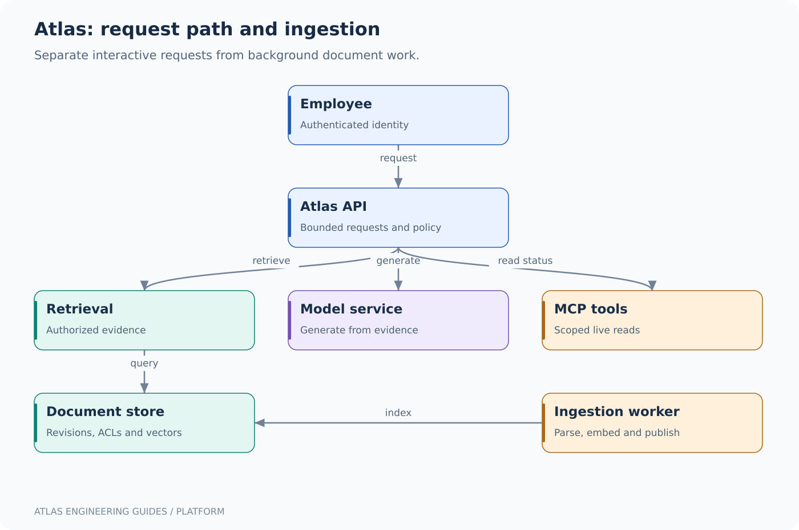

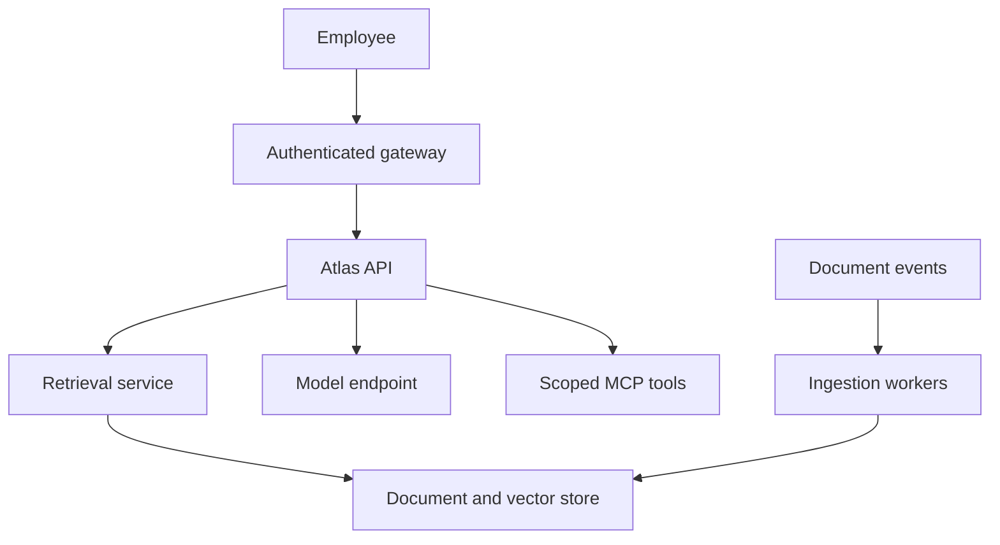
```mermaid
flowchart TD
    U[Employee] --> G[Authenticated gateway]
    G --> A[Atlas API]
    A --> R[Retrieval service]
    A --> M[Model endpoint]
    R --> D[Document and vector store]
    W[Ingestion workers] --> D
    Q[Document events] --> W
    A --> T[Scoped MCP tools]
```

Keep a **control plane** and a **data plane** mentally separate. Git, CI, the container registry, deployment controllers and Kubernetes manage what runs. Employee questions, document chunks, model requests and answers are application data. A failed Git server should not stop existing Pods from answering questions. Conversely, a healthy GitOps dashboard does not prove answers are correct.

The three books share this architecture. the CI/CD guide makes releases and runtime behavior understandable. the AI platform guide explains the retrieval and tool protocols. the Spring AI/Python guide implements the language-specific pieces. The code bundle contains an offline retrieval lab, optional model-backed applications, manifests, and a CI skeleton. The supplied Kubernetes manifests are templates for your registry and environment, not a deployment performed on your behalf.

<a id="section-11"></a>

## 2. CI, delivery, deployment and GitOps are different responsibilities

**Continuous integration** establishes evidence about a candidate change: it compiles, passes tests, adheres to policy and can produce an artifact. **Continuous delivery** keeps an approved artifact ready to release; production may have an explicit approval. **Continuous deployment** automatically releases candidates that satisfy the defined gates. **GitOps** repeatedly compares a declarative desired state in version control with observed cluster state.

Consider commit `c42` changing both an API and its prompt. CI produces image digest `sha256:d42` and an evaluation report. Staging and production should run that same digest. Rebuilding “the same commit” in production can change dependencies, base images or generated files. Artifact promotion keeps the object being promoted identical, while configuration varies deliberately.

| Object | Identifies | Example failure if confused |
|---|---|---|
| Git commit | Source snapshot | Does not uniquely identify an image built with moving dependencies |
| Image tag | Mutable registry reference | `latest` points to different bytes during rollback |
| Image digest | Content-addressed manifest | Correct image still uses a wrong database URL |
| Environment commit | Desired deployed configuration | Manual cluster patch is overwritten by reconciliation |
| Release record | Code, prompt, schema and model contract | Good code paired with incompatible embeddings |

For Atlas, a release record contains the image digest, prompt version, retrieval configuration, embedding-model identifier, index generation, model-generation identifier and evaluation dataset revision. Not every change must deploy a container, but every behavior-changing change needs provenance.

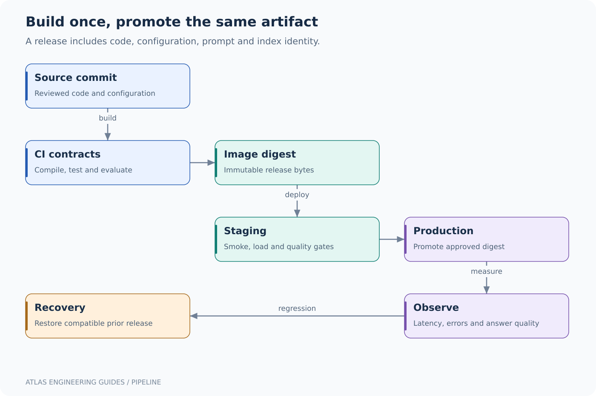

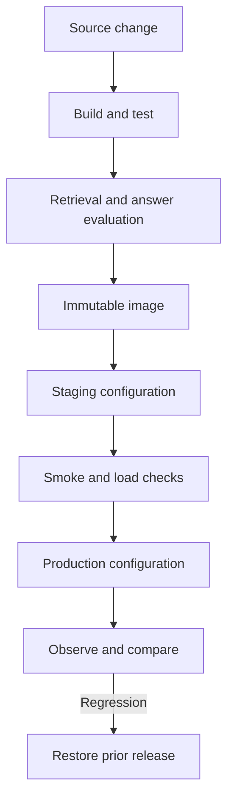
```mermaid
flowchart TD
    C[Source change] --> T[Build and test]
    T --> E[Retrieval and answer evaluation]
    E --> I[Immutable image]
    I --> S[Staging configuration]
    S --> V[Smoke and load checks]
    V --> P[Production configuration]
    P --> O[Observe and compare]
    O -->|Regression| B[Restore prior release]
```

### 2.1 Gates should answer specific questions

A unit test can show that a tenant predicate is generated correctly. An integration test shows the actual database honors the query with the actual schema and driver. A retrieval evaluation shows relevant evidence was found. An answer evaluation checks grounding, correctness and abstention. A canary tests behavior under real load. Passing one cannot substitute for the others.

For a prompt change, run a fixed set of answerable, unanswerable, ambiguous and adversarial questions. For a dependency update, run protocol contracts and serialization tests. For a chunking change, rebuild a staging index and compare retrieval quality before promoting. For an infrastructure change, check scheduling, permissions and traffic routing.

### 2.2 The trust boundary around pull requests

Pull-request code is code execution. A malicious dependency install, build plugin or test can read credentials available to its runner. Therefore untrusted PR checks get read-only repository access and no production credentials. Publishing and deployment run only from a trusted revision in a separate job/environment. Avoid workflows that execute untrusted checkout code with privileged event contexts.

Pin third-party actions to reviewed full commit SHAs for an immutable reference; use an updater to propose reviewed upgrades. A cache accelerates rebuilding; it is not an authoritative release artifact. Key caches by dependency-lock inputs and keep trust domains separate. GitHub documents action pinning, script-injection risks and workflow-token permissions in its [secure-use guidance](https://docs.github.com/en/actions/reference/security/secure-use).

### 2.3 OIDC: temporary credentials with a narrow trust policy

A CI job requests an identity token. A cloud security-token service validates its issuer, audience and subject against a trust policy, then issues short-lived credentials. Limit the subject to the intended repository, branch or deployment environment. “Any workflow in this organization” is usually much broader than necessary. The token lifetime does not compensate for a role with administrator privileges. See [GitHub Actions OIDC](https://docs.github.com/en/actions/concepts/security/openid-connect).

For example, the production publish job may write one repository in a registry and propose an environment manifest change. It does not need permission to list every secret or delete a cluster. The cluster's GitOps controller has a separate identity. A compromise in one role should not automatically provide both artifact production and unrestricted deployment powers.

<a id="section-12"></a>

## 3. Containers: what actually gets packaged

An image is a collection of filesystem layers plus runtime metadata. A container is a process with isolation and resource controls, running against that image and a writable layer. It is not a small virtual machine with its own independent kernel. Namespaces affect visibility; cgroups account for and constrain resources. Images improve packaging reproducibility, but host architecture, kernel behavior and external services still matter.

### 3.1 Java image design

Use a build stage containing a JDK and Maven, then a runtime stage with only the application and required runtime. Maven dependencies are resolved during build, not at API startup. Run as a non-root user. Make temporary write locations explicit. A read-only root filesystem works only if the application has writable mounts for necessary temporary files.

```dockerfile
# Teaching baseline: replace reviewed tags with verified digests in release builds.
FROM maven:3.9-eclipse-temurin-21 AS build
WORKDIR /work
COPY pom.xml .
COPY src src
RUN mvn -B -ntp package

FROM eclipse-temurin:21-jre
WORKDIR /app
COPY --from=build /work/target/atlas.jar /app/atlas.jar
USER 10001:10001
EXPOSE 8080
ENTRYPOINT ["java", "-XX:MaxRAMPercentage=60", "-jar", "/app/atlas.jar"]
```

The 60% heap limit is an initial budget, not a universal tuning rule. A 1 GiB container also needs metaspace, code cache, thread stacks, direct buffers, native libraries and JVM overhead. A heap maximum of 1 GiB inside a 1 GiB container leaves no room for these. Measure resident memory and GC under representative concurrency.

### 3.2 Python image design

Create an isolated virtual environment or install from a resolved lock file into a controlled image. Native packages may require compiler libraries during build and runtime shared objects afterward. CPU/GPU wheel variants and system libraries must match. A single Uvicorn process is often easier to size per Pod; multiple workers multiply model and cache memory unless sharing is explicitly supported.

For example, four Python workers each loading a 2 GiB embedding model can consume roughly four copies of model state, with platform-specific sharing behavior. “Four cores, four workers” is not sufficient reasoning. Separate heavy embedding inference into a bounded inference service when it improves batching and memory use.

Docker's [multi-stage build documentation](https://docs.docker.com/build/building/multi-stage/) explains artifact transfer between stages. The architectural choice is to ship the runtime dependency closure, rather than the compiler, package-manager cache and build credentials.

### 3.3 Supply-chain evidence

Generate a software bill of materials, scan dependencies and image layers, record build provenance and verify release signatures according to your organization’s policy. A signature answers who attested to particular bytes; it does not prove the code is safe. A clean vulnerability scan does not prove no vulnerabilities exist. These checks complement tests and least privilege.

Build-time secrets must not be embedded in Docker `ARG`, copied files, generated config or committed layers. Removing a secret in a later layer does not reliably erase it from earlier layers. Use the builder’s secret facilities for private dependency access, then inspect the resulting image and history.

<a id="section-13"></a>

## 4. Kubernetes internals through a deployment trace

Suppose desired state says “run three Atlas API replicas.” The API server authenticates and authorizes the request, admission applies checks/defaults, and persistent cluster state records the object. Controllers observe the Deployment and reconcile ReplicaSets and Pods. The scheduler assigns unscheduled Pods to suitable nodes. Each node's kubelet asks its container runtime to realize assigned workloads. Networking and storage plugins handle their respective integrations.

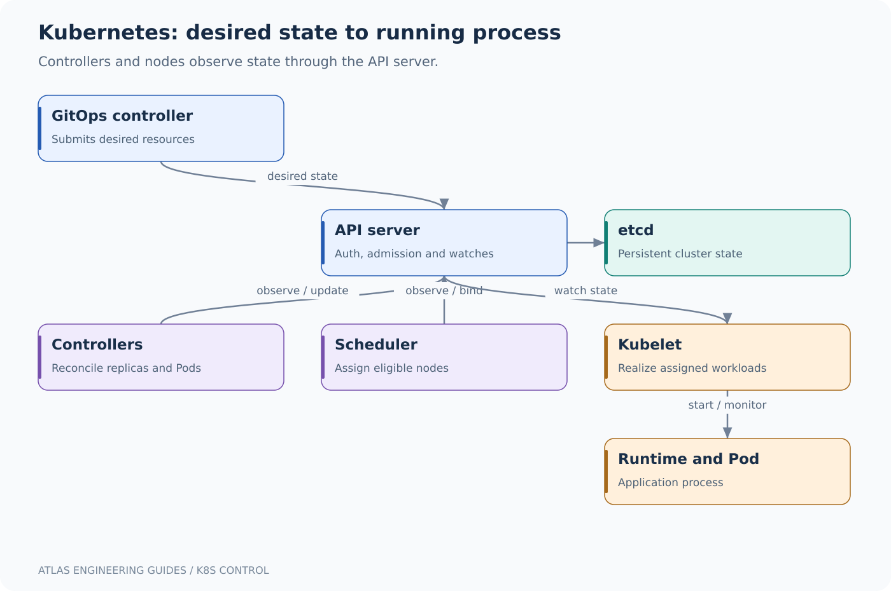

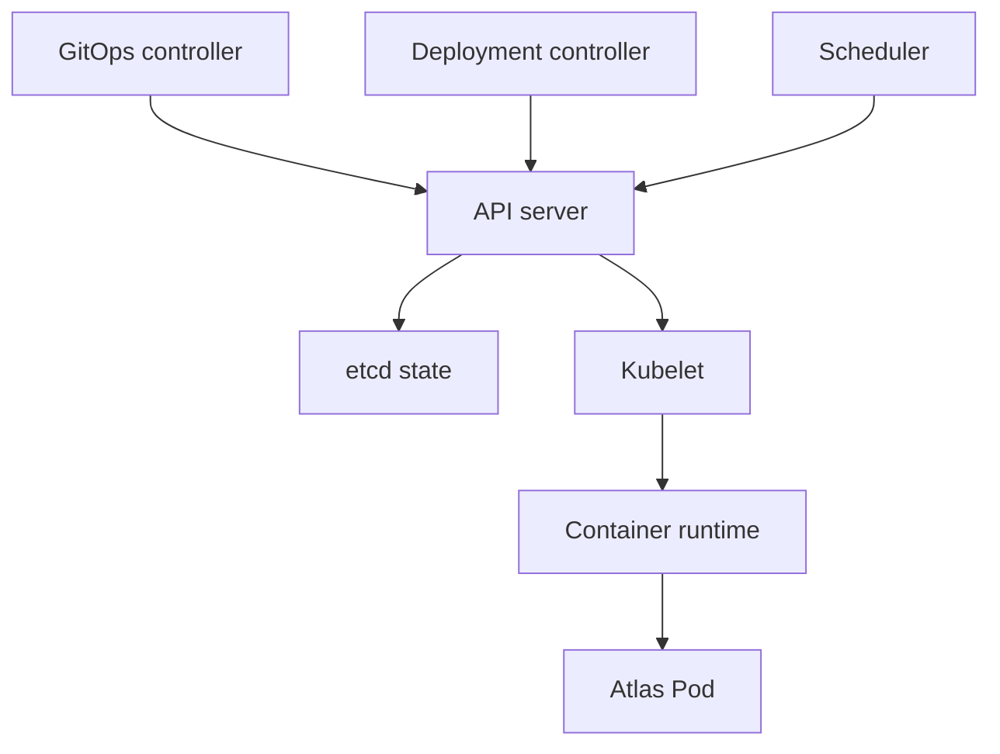
```mermaid
flowchart TD
    G[GitOps controller] --> A[API server]
    A --> E[etcd state]
    C[Deployment controller] --> A
    S[Scheduler] --> A
    A --> K[Kubelet]
    K --> R[Container runtime]
    R --> P[Atlas Pod]
```

The arrows summarize responsibilities, not every network connection. Components commonly watch API state rather than receive a direct command from one another. If the scheduler is unavailable, existing Pods can continue but new unscheduled Pods cannot be placed. If a worker fails, replacement needs spare capacity and functioning control-plane reconciliation. “Self-healing” is conditional on those prerequisites. The [Kubernetes architecture documentation](https://kubernetes.io/docs/concepts/architecture/) is the authoritative component reference.

### 4.1 Pod, ReplicaSet, Deployment, Job, StatefulSet and DaemonSet

| Resource | What it controls | Atlas example | Important limit |
|---|---|---|---|
| Pod | One scheduling unit with shared network and selected volumes | API container plus a tightly coupled helper | A replaced Pod has a new identity |
| ReplicaSet | Desired number of matching Pods | Three API replicas | Usually managed by Deployment |
| Deployment | ReplicaSet revisions and rollout | Stateless query API | Does not migrate a database |
| Job | Work expected to finish | Backfill an embedding index | Work must tolerate retries |
| CronJob | Scheduled Job creation | Periodic source reconciliation | Prevent duplicate effects |
| StatefulSet | Stable ordinal identity and storage association | Specialized stateful service | Does not implement replication or backups |
| DaemonSet | Node-level agents on selected nodes | Telemetry or networking agent | Consumes resources on each selected node |

A sidecar is appropriate when lifecycle and locality need to be coupled, such as a local proxy. It is a poor substitute for an independently scaled parser worker. Sharing a Pod couples resource placement and failure handling: you cannot scale just one container by changing the replica count.

### 4.2 Labels are part of the architecture

Service selectors, policy selectors and workload selectors depend on labels. A typo can yield a healthy Service with zero endpoints. Reusing a broad label can accidentally route traffic to a different version or grant a network path to unrelated Pods. Treat label schemas as contracts: `app=atlas-api`, `component=query`, `environment=staging`.

Namespaces organize names, quotas and policy scope; they do not by themselves establish complete tenant isolation. Cluster-scoped permissions, network access and shared nodes remain relevant.

<a id="section-14"></a>

## 5. Scheduling and resource math

Requests guide scheduling and, for CPU utilization autoscaling, the denominator of utilization. Limits constrain consumption using resource-specific mechanisms. CPU can be throttled. Exceeding available memory or a memory limit can trigger termination; memory is not simply slowed down. Use the [resource-management reference](https://kubernetes.io/docs/concepts/configuration/manage-resources-containers/) for precise semantics and version-specific options.

### 5.1 Worked capacity example

Assume each API Pod requests 500 millicores and 768 MiB. A node has 4 allocatable CPU cores and 7 GiB allocatable memory after system reservations. CPU permits eight such Pods; memory permits floor(7168 / 768) = nine. CPU is the tighter scheduler bound, before other workloads and placement rules.

That does **not** prove eight Pods meet latency targets. If each can burst to two cores, all eight cannot simultaneously sustain that demand on four cores. Requests express reserved scheduling capacity; actual performance requires load testing and headroom. Include surge Pods during rollouts and replacement capacity during a zone failure.

### 5.2 Scheduling constraints and deadlocks

Node affinity selects compatible hardware or node pools. Taints repel Pods unless they tolerate them. Toleration permits placement; it does not force placement. Topology spread constraints distribute replicas across nodes or zones. An overly strict constraint can leave Pods Pending when one zone lacks capacity.

For three replicas spread over three zones, losing one zone should leave two serving. But a rollout with `maxUnavailable: 0` and `maxSurge: 1` requires somewhere to schedule the extra Pod. If every node is full, the rollout stalls. This is a capacity-design issue, not a broken Deployment controller.

### 5.3 GPU inference is a separate sizing problem

GPU memory must accommodate model weights, KV cache, runtime buffers and batching. Approximate weight storage is `parameters × bytes per parameter`; 8 billion parameters at 2 bytes require about 16 GB decimal just for weights. Quantization reduces weight memory but does not remove KV-cache and runtime overhead. Context length and active requests often dominate marginal memory.

A CPU-based HPA cannot infer GPU memory pressure or a growing token queue. Scale inference using suitable queue, latency and accelerator metrics, with model warm-up time included. More API replicas will not fix one overloaded model replica or an exhausted hosted-model token quota.

<a id="section-15"></a>

## 6. Networking: follow one request

An external client resolves a public DNS name. A load balancer or gateway accepts traffic and routes an HTTP request to a Kubernetes Service's selected endpoints. A Service provides a stable abstraction over changing Pod addresses. Cluster DNS maps service names to discoverable addresses. The installed network implementation determines packet forwarding details.

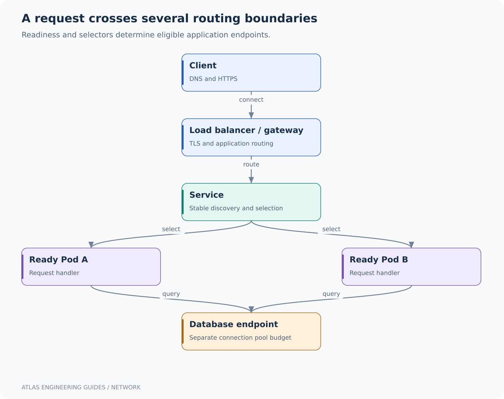

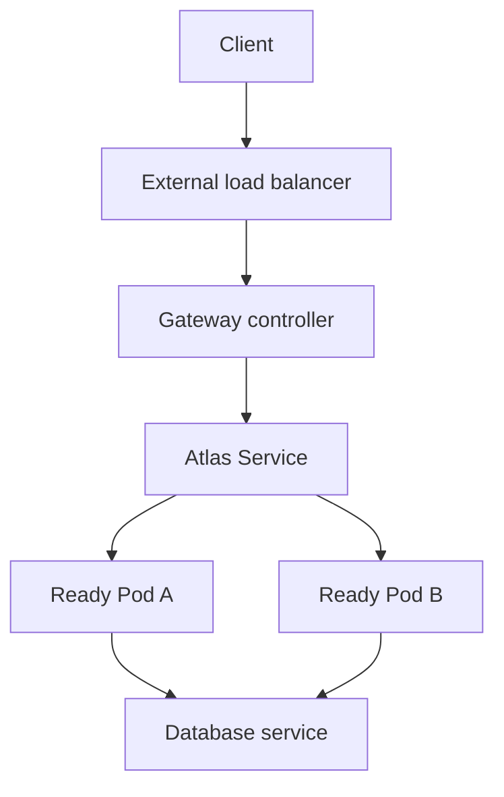
```mermaid
flowchart TD
    C[Client] --> L[External load balancer]
    L --> G[Gateway controller]
    G --> S[Atlas Service]
    S --> A[Ready Pod A]
    S --> B[Ready Pod B]
    A --> D[Database service]
    B --> D
```

### 6.1 Service types and routes

A `ClusterIP` Service is for internal discovery. `NodePort` exposes a port on nodes. `LoadBalancer` asks an implementation/provider for external balancing. A headless Service exposes endpoint discovery without a normal virtual cluster IP. These are different from application-layer URL routing.

Ingress and Gateway API describe routing; a controller must implement them. A manifest alone does not install a working proxy. Gateway API separates infrastructure ownership from route ownership more explicitly; verify which resources and features your controller supports. The sample bundle uses a ClusterIP Service and local port-forwarding so it does not assume an installed public gateway. See [Kubernetes Services](https://kubernetes.io/docs/concepts/services-networking/service/).

### 6.2 Streaming changes proxy behavior

An AI answer may arrive incrementally over SSE. Disable inappropriate response buffering at the chosen proxy, set an intentional idle timeout, and pass cancellation downstream. Long connections are not redistributed midstream when new Pods appear. A load balancer with three Pods does not guarantee equal numbers of active token streams.

Distinguish time to first token, token rate and time to complete. A server can emit one token quickly and then take 90 seconds to finish. Streaming improves perceived responsiveness but does not eliminate work or model latency.

### 6.3 NetworkPolicy and egress

NetworkPolicy selects Pods and allowed traffic; enforcement requires a network implementation that supports it. Policies are additive and apply independently to ingress and egress. A default-deny policy needs explicit allowances for DNS and approved destinations. Native policies are not generally a portable hostname-based firewall for changing public model IPs. Use a controlled egress proxy or supported implementation-specific mechanism when hostname policies are required. See [NetworkPolicy semantics](https://kubernetes.io/docs/concepts/services-networking/network-policies/).

Test policy behavior with real connections, including DNS over both expected protocols. A YAML file accepted by the API server is not evidence that your network plugin enforces it.

<a id="section-16"></a>

## 7. Health checks, shutdown and rolling updates

### 7.1 Three probes, three decisions

| Probe | Decision | Good Atlas check | Bad check |
|---|---|---|---|
| Startup | Has initialization completed? | Server initialized and essential local state loaded | Arbitrarily short timeout while a model downloads |
| Readiness | Should new traffic be routed here? | This instance can accept bounded work | Expensive full end-to-end generation on every probe |
| Liveness | Is restarting this process useful? | Process cannot make progress | Hosted model provider is temporarily unavailable |

If all liveness probes depend on a failed database, Kubernetes restarts every API Pod precisely when the system needs stable connections and controlled recovery. Decide whether a dependency failure should mark readiness false or be handled by a degraded response. For Atlas, an unavailable optional MCP tool should not remove the RAG API from service.

Startup probes defer readiness/liveness probe execution until startup succeeds. Readiness failures remove the instance from eligible traffic handling, subject to propagation. Liveness failures can restart a container. The [probe documentation](https://kubernetes.io/docs/tasks/configure-pod-container/configure-liveness-readiness-startup-probes/) explains thresholds and timing.

### 7.2 Termination is a race with multiple participants

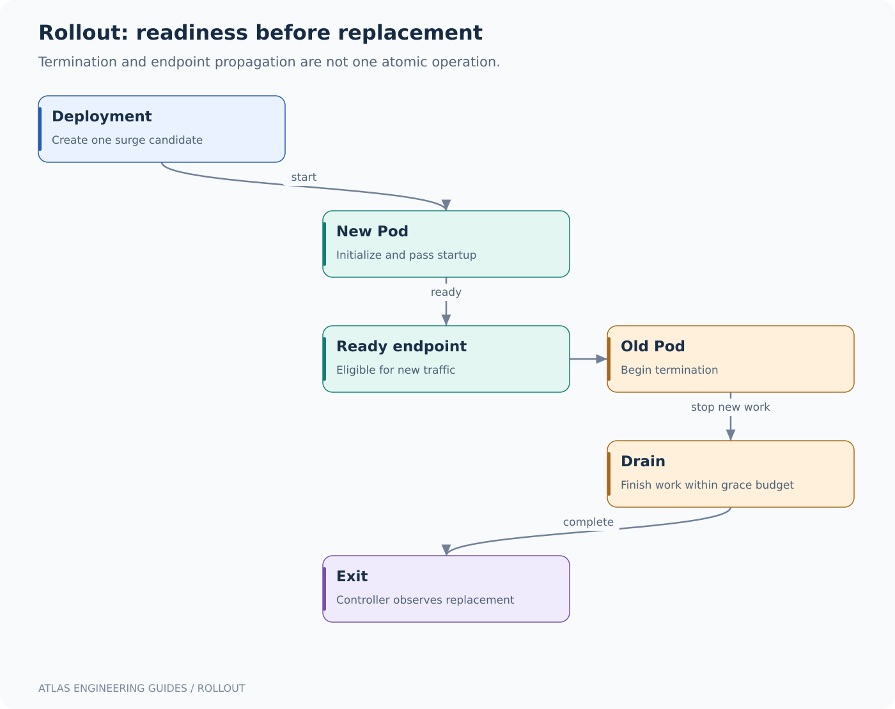

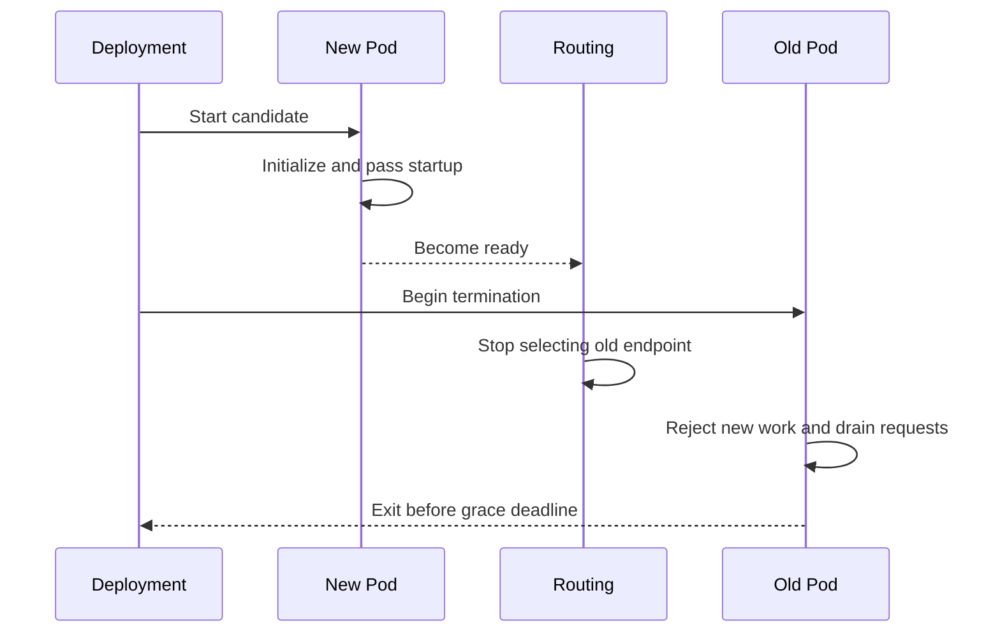
```mermaid
sequenceDiagram
    participant D as Deployment
    participant N as New Pod
    participant R as Routing
    participant O as Old Pod
    D->>N: Start candidate
    N->>N: Initialize and pass startup
    N-->>R: Become ready
    D->>O: Begin termination
    R->>R: Stop selecting old endpoint
    O->>O: Reject new work and drain requests
    O-->>D: Exit before grace deadline
```

Endpoint changes and process termination are not one atomic operation. During propagation, some traffic may reach a terminating Pod. The server should handle graceful shutdown and stop accepting new work while completing in-flight work within a deadline. A short `preStop` delay can help propagation in some installations, but it consumes the same overall termination budget. It is not proof of zero dropped requests.

If generation has a 10-second deadline, allow additional time for routing propagation and cleanup. A 45-second Pod grace period and a 20-second application shutdown phase are reasonable initial **lab assumptions**, not global defaults. Test by terminating a Pod during a stream and observing the client outcome.

### 7.3 Rollout controls and disruption budgets

For three replicas, `maxUnavailable: 0` keeps the controller from intentionally reducing available replicas during rollout, while `maxSurge: 1` permits a fourth candidate. `minReadySeconds` helps avoid treating a briefly healthy Pod as stable. `progressDeadlineSeconds` reports a stalled rollout; a Deployment does not automatically implement your desired rollback policy.

A PodDisruptionBudget constrains eligible voluntary evictions such as a node drain. It does not guarantee survival of hardware failure and does not replace Deployment rollout settings. A single replica with `minAvailable: 1` can block a drain indefinitely. See [Deployments](https://kubernetes.io/docs/concepts/workloads/controllers/deployment/) and [disruptions](https://kubernetes.io/docs/concepts/workloads/pods/disruptions/).

<a id="section-17"></a>

## 8. Autoscaling with queueing theory

Use Little's Law, `L = λW`, for a stable system. If 30 requests/second spend an average of 4 seconds in flight, average concurrency is about 120. If each Pod deliberately permits 20 model requests concurrently, six Pods cover the arithmetic average, with additional headroom needed for burstiness, tails and failures. This is a concurrency estimate, not a throughput benchmark.

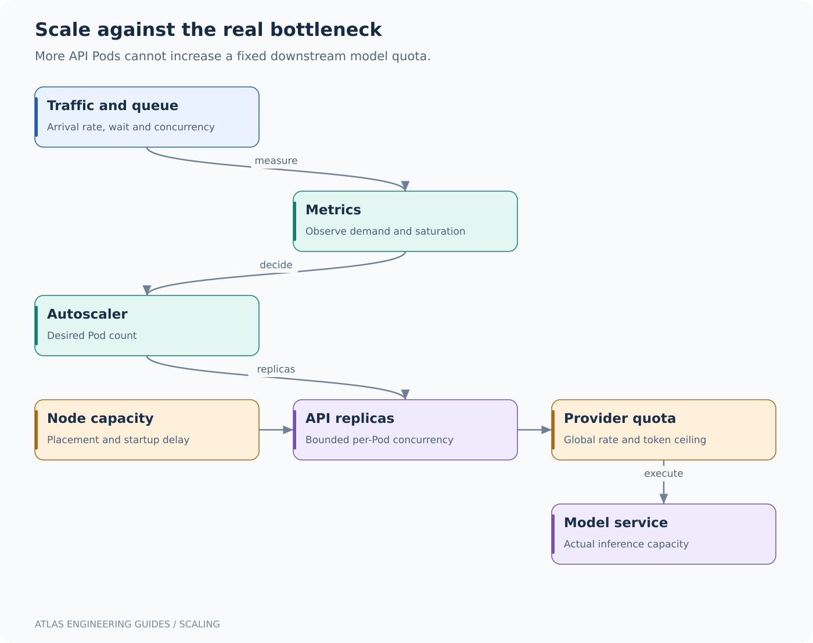

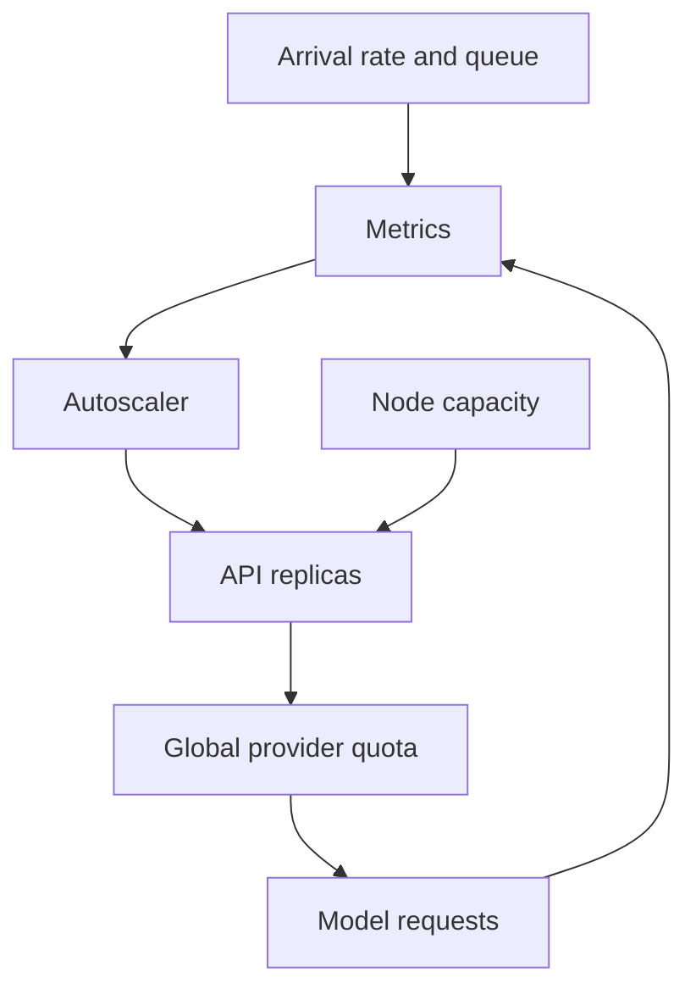
```mermaid
flowchart TD
    Q[Arrival rate and queue] --> M[Metrics]
    M --> H[Autoscaler]
    H --> P[API replicas]
    P --> L[Global provider quota]
    L --> R[Model requests]
    R --> M
    N[Node capacity] --> P
```

For a CPU-based HPA, a simplified calculation is `desired replicas = ceil(current replicas × measured utilization / target utilization)`. Three replicas at 90% measured utilization against a 60% target suggest five replicas. Real HPA behavior includes tolerances, missing metrics, readiness handling and stabilization; the formula alone is not its complete algorithm. See [HPA behavior](https://kubernetes.io/docs/concepts/workloads/autoscaling/horizontal-pod-autoscale/).

### 8.1 Why I/O-heavy AI APIs need extra metrics

An API awaiting model responses can have low CPU and high queue latency. Prefer in-flight request counts, queue age or pending work, together with provider rate limits. If a provider permits 60 requests/second globally, scaling from 6 to 60 Pods must not give each Pod a separate 60 requests/second allowance.

Use admission control: reject or defer new work before unbounded queues form. Establish a maximum pending count and queue-wait budget. Return a retryable overload response with appropriate retry guidance. An ingestion queue can tolerate minutes of delay; an interactive answer usually cannot.

### 8.2 HPA, node autoscaling and vertical changes

HPA creates more Pod demand. A node autoscaler can add suitable compute when Pods cannot be scheduled. Startup time includes node provisioning, image pull, model loading and readiness. None is instantaneous. Vertical changes resize resources and can interact with CPU utilization targets; avoid having independent controllers fight over the same request settings.

For document workers, queue depth alone is misleading if one document is 50 pages and another 50,000 pages. Track estimated work units, oldest-message age, throughput and retry rates. Separate poison documents into a dead-letter workflow with source IDs and error reasons.

<a id="section-18"></a>

## 9. Configuration, identity and persistent state

ConfigMaps hold non-secret configuration. Secrets carry sensitive configuration, but base64 is encoding, not encryption. Configure encryption at rest and access control, and use workload identity or an external secret mechanism where appropriate. Mount only what a workload needs. Rotating a Secret does not guarantee every process rereads it; environment variables are captured at process creation.

### 9.1 Service accounts and cloud identities

A Kubernetes service account is an application identity for Kubernetes-related authentication. A cloud workload-identity integration maps a workload to cloud permissions without distributing a long-lived access key. These roles are conceptually separate from employee identity. Atlas needs both: the workload may access a document bucket, but each employee must still be authorized for individual documents.

The query API does not need to modify Deployments. A read-only status MCP server might need narrowly scoped `get` access to selected resources. A documentation tool should not inherit the CI deployer's credentials. Disable automatic service-account token mounting where a workload does not use it.

### 9.2 Persistent volumes do not equal data durability

A PersistentVolumeClaim requests storage; a provisioner/StorageClass determines how it is supplied. Access modes, zone affinity, reclaim behavior and driver capabilities affect recovery. A database Pod can be replaced while its disk persists, but that does not create a second synchronized database copy. Snapshots need application-consistent recovery procedures. See [persistent-volume concepts](https://kubernetes.io/docs/concepts/storage/persistent-volumes/).

For Atlas, managed PostgreSQL is often a sensible first production choice because backups, upgrades and failover require operational expertise. Running it inside Kubernetes is possible, but requires a suitable operator, tested restoration, topology design and a clear owner. Kubernetes is an orchestration substrate, not a database recovery algorithm.

### 9.3 Expand–migrate–contract schema changes

Version 1 reads `body`; version 2 needs `body_normalized`. First add the new nullable field. Deploy code compatible with both. Backfill in bounded batches with restartable checkpoints. Switch reads after validation. Remove the old field only after the rollback window and old consumers expire.

An image rollback cannot restore a dropped column or undo corrupted embeddings. Index generations need the same care: build generation B alongside A, evaluate B, atomically switch the active-generation pointer, retain A for rollback, and only later remove A. This is a data rollout as well as a code rollout.

<a id="section-19"></a>

## 10. GitOps, canaries and recovery

Argo CD compares repository desired state with live resources and can reconcile automatically. Automated sync, pruning and self-healing are independent choices; configure them intentionally. A manually edited Deployment can be changed back by reconciliation. Roll back by changing the source of truth to a known-good release, rather than creating an undocumented fight with the controller. See [Argo CD automated sync](https://argo-cd.readthedocs.io/en/stable/user-guide/auto_sync/).

### 10.1 Rolling, blue–green and canary

| Strategy | Mechanism | Benefit | Main risk |
|---|---|---|---|
| Rolling | Replace subsets of replicas | Moderate extra capacity | Old and new versions coexist |
| Blue–green | Maintain two environments and switch traffic | Fast traffic rollback | Double capacity; data compatibility remains |
| Canary | Route a measured subset to candidate | Detect real regressions early | Small samples or biased cohorts mislead |
| Shadow | Copy requests without using candidate responses | Compare behavior safely for reads | Extra cost and potential side effects |

An ordinary Deployment does not implement percentage-based canary traffic by itself. Use a suitable rollout controller and routing integration. Ten percent of Pods is not reliably ten percent of requests with long-lived connections and uneven workloads.

For AI canaries, measure authorization failures, evidence recall on monitored tasks, abstention, token cost and completion latency. A candidate can return HTTP 200 while citing the wrong policy. Shadow traffic must disable mutating tools and protect user data just like live traffic.

### 10.2 Recovery runbook: the new release returns 503

1. Determine the scope: all routes, one tenant, one availability zone, one model provider, or only new Pods.
2. Inspect rollout status, Pod events and readiness. A missing Secret and a broken image produce different evidence.
3. Compare candidate and prior release using request metrics and logs keyed by release ID.
4. Stop promotion. Restore the prior environment digest if it remains schema/index compatible.
5. Confirm traffic health and answer behavior after recovery. A completed rollback command is not the success criterion.
6. Preserve a concise incident record: triggering change, observed impact, recovery action and follow-up control.

Useful diagnostic commands, run against your intended context:

```bash
kubectl config current-context
kubectl -n atlas get pods,svc,endpointslices
kubectl -n atlas describe deployment atlas-api
kubectl -n atlas get events --sort-by=.lastTimestamp
kubectl -n atlas logs deployment/atlas-api --tail=200
kubectl -n atlas rollout status deployment/atlas-api --timeout=120s
```

Do not paste production tokens, full prompts or confidential retrieved chunks into incident channels. Prefer trace IDs and redacted context with controlled access to detailed evidence.

<a id="section-20"></a>

## 11. AWS, Azure, GCP and independent alternatives

These are **capability mappings**, not claims that products have identical semantics or that one vendor leads every category. Compare region availability, identity integration, quotas, operating burden and exit cost against your requirements.

| Capability | AWS | Azure | Google Cloud | Independent / self-managed examples |
|---|---|---|---|---|
| Managed Kubernetes | EKS | AKS | GKE | Red Hat OpenShift; Rancher-managed clusters |
| Container registry | ECR | ACR | Artifact Registry | Harbor; GitHub Container Registry |
| Build / release platform | CodeBuild and CodePipeline | Azure Pipelines | Cloud Build and Cloud Deploy | GitHub Actions; GitLab CI; Jenkins; Tekton |
| Kubernetes GitOps | Install chosen controller | Install/integrate chosen controller | Install/integrate chosen controller | Argo CD; Flux |
| Object storage | S3 | Blob Storage | Cloud Storage | Compatible object-store products; verify API semantics |
| Managed model access | Bedrock | Microsoft Foundry ecosystem | Google managed AI platform | Anthropic API; independent inference providers |
| Self-hosted inference | Compute/GPU platform | Compute/GPU platform | Compute/GPU platform | vLLM; Ollama for development and suitable deployments |

EKS, AKS and GKE manage varying parts of a Kubernetes platform, with additional modes and integrations. They do not remove application-level reliability work. Verify node responsibility, upgrade policies, networking and identity in the respective [EKS](https://docs.aws.amazon.com/eks/latest/userguide/what-is-eks.html), [AKS](https://learn.microsoft.com/en-us/azure/aks/what-is-aks) and [GKE](https://cloud.google.com/kubernetes-engine/docs/concepts/kubernetes-engine-overview) documentation.

**Decision example:** a Java team already operating Azure identity and PostgreSQL may get more value from AKS plus managed dependencies than from changing clouds for one attractive model. A small team with modest traffic may prefer a managed container service instead of Kubernetes. A regulated team with established cluster operations may value private inference. The “best” platform is the one whose capabilities fit the constraints and whose failure modes the team can operate.

For CI, GitHub Actions is convenient when code and review already live on GitHub. GitLab CI offers tight integration in GitLab. Jenkins provides extensive control but requires plugin and controller operations. Tekton expresses pipeline execution as Kubernetes resources and suits platform teams prepared to own that infrastructure. Argo CD deploys/reconciles; it is not a general replacement for every build task.

<a id="section-21"></a>

## 12. Hands-on progression and interview reasoning

### Lab A: build and identify an artifact

Run the offline tests in the bundle. Inspect the Maven build and Python package inputs. Build one image in an environment with Docker and dependencies. Record its digest. Change a runtime configuration value and explain why the digest need not change. Then alter source and observe that the image identity changes. Explain which evidence ties the image to its source and dependency resolution.

### Lab B: observe recovery rather than assume it

Deploy a locally adapted manifest to a disposable cluster. Port-forward the Service. Delete one Pod and watch the replacement. Introduce a wrong readiness path and observe why the rollout stops receiving new ready replicas. Restore the path. Compare an application crash, a failed image pull and a Pending Pod: each is a different lifecycle problem.

### Lab C: test load and a bottleneck

Cap model concurrency at four calls per Pod and simulate two-second calls. Increase traffic past the service rate. Measure queue delay, rejection rate and completion time. Add Pods, then impose a global model quota. Explain why API scaling stops helping. This exercise is more useful than memorizing autoscaler YAML.

### Questions with answer direction

**Why not put every dependency in liveness?** Restarting the caller does not restore a failed dependency and may amplify reconnection load. Separate process recovery from dependency degradation.

**Why can a rollout stall with all current Pods healthy?** There may be no capacity for surge, an unsatisfied topology constraint, an unpullable image, or a readiness failure in the candidate. Inspect events before changing replica counts.

**What makes rollback safe?** A retained artifact plus compatible schema, index generation, configuration and external contracts. Code rollback alone is insufficient.

**Why do 20 replicas overload PostgreSQL?** Each may have its own pool. At 20 maximum connections per replica, 20 replicas permit 400 client connections, before workers and operational clients. Budget concurrency end to end.

**What would you monitor first?** User-visible error and latency distributions, then queue age, in-flight work, model quotas, readiness, restarts and database saturation. A CPU dashboard alone cannot explain answer correctness.

The mastery exercise is to draw Atlas from source commit to running request, then explain what persists, what retries, what authorizes and what can fail at every boundary.

<a id="section-22"></a>

## 13. Configuration packaging: Helm, Kustomize and rendered evidence

Copying an entire Deployment into `dev.yaml`, `staging.yaml` and `prod.yaml` creates drift. One file gains a probe fix while another retains the old path. Solve this with a shared base and explicit environment variation, then review the resulting manifests rather than only the template source.

**Kustomize** applies overlays and transformations to Kubernetes resources. It works well when the resource shapes are mostly stable and differences are image names, resource budgets, labels or selected fields. **Helm** renders charts using templates and values, which is useful for packaging configurable applications and dependencies. Both can generate a bad manifest from valid inputs. See [Kustomize](https://kubernetes.io/docs/tasks/manage-kubernetes-objects/kustomization/) and [Helm templates](https://helm.sh/docs/chart_template_guide/).

### 13.1 Worked overlay

A Kustomize overlay can select the verified image and increase memory without duplicating the full application spec:

```yaml
apiVersion: kustomize.config.k8s.io/v1beta1
kind: Kustomization
resources:
  - ../../base
images:
  - name: registry.example.com/atlas
    newName: registry.example.com/atlas
    newTag: approved-release-example
patches:
  - target:
      kind: Deployment
      name: atlas-api
    patch: |-
      - op: replace
        path: /spec/template/spec/containers/0/resources/requests/memory
        value: 1Gi
```

For a real release, replace a mutable tag with the verified digest using the supported image transformation. The numeric container index in this illustrative JSON patch assumes the API is container zero; a structural reordering would invalidate that assumption. Prefer selectors/patch forms that remain robust under your expected changes, and inspect rendered output in CI.

Render with `kubectl kustomize path/to/overlay` or `helm template` for a chart. Validate against the target cluster's supported APIs and admission policies. A YAML parser catches malformed indentation; it does not know that a removed API version or forbidden security context will be rejected by your cluster. Server-side dry runs add relevant validation when a representative cluster is available.

### 13.2 Avoid shared-field controller conflicts

If HPA controls replica count, configure GitOps so routine reconciliation does not repeatedly force a different count. If an operator owns a child resource, do not patch the child independently while expecting the operator to preserve it. Identify field ownership explicitly: the API server stores fields, while controllers continuously make decisions based on them.

Helm values are configuration inputs, not a safe place to commit plaintext secrets. A generated manifest may still contain a secret even when the template looks harmless. Review rendered artifacts with appropriate access controls and redaction.

<a id="section-23"></a>

## 14. Narrow permissions for a live deployment-status tool

The training MCP tool returns synthetic data. A live implementation could read one Deployment's status through a separate service account. Grant only the necessary namespaced action instead of attaching the application's general administrator identity.

```yaml
apiVersion: rbac.authorization.k8s.io/v1
kind: Role
metadata:
  name: read-payments-status
  namespace: payments
rules:
  - apiGroups: [apps]
    resources: [deployments]
    resourceNames: [payments-api]
    verbs: [get]
---
apiVersion: rbac.authorization.k8s.io/v1
kind: RoleBinding
metadata:
  name: atlas-status-reader
  namespace: payments
subjects:
  - kind: ServiceAccount
    name: atlas-status-reader
    namespace: atlas
roleRef:
  apiGroup: rbac.authorization.k8s.io
  kind: Role
  name: read-payments-status
```

Create and configure the separate service account and authenticated client deliberately; this excerpt does not modify the API service account in the supplied manifest. The role allows a named `get`, not arbitrary list/watch or modification. Kubernetes authorization and employee authorization are both required: a backend credential capable of reading the object does not imply every employee may invoke that read. See [Kubernetes RBAC](https://kubernetes.io/docs/reference/access-authn-authz/rbac/).

For the returned status, include observed generation, desired/ready/available replica counts and the observation timestamp. “3 ready” may describe the old generation while the new rollout is stuck. Compare `status.observedGeneration` with the resource's generation and explain the distinction in the tool response. A model should receive structured fields and freshness context rather than a misleading single `healthy=true` boolean.

### 14.1 ResourceQuota and LimitRange

A namespace ResourceQuota can prevent a team from consuming all cluster resources; a LimitRange can provide bounds/defaults for workload resource declarations. They are resource governance, not workload sizing algorithms. If a rollout needs one surge Pod but the namespace quota has no spare capacity, admission may reject it even when a node has room.

Plan quota for steady state, rollout surge, Jobs and recovery. For AI ingestion, batch workloads should not starve interactive serving. Separate queues and resource pools, use suitable priorities and make overload behavior explicit. Priority/preemption is a last-resort scheduling policy, not an alternative to capacity planning.

### 14.2 An effective disaster-recovery drill

Choose a failure boundary: one Pod, one node, one zone, the database or the entire region. State the recovery-point objective (acceptable data loss) and recovery-time objective (acceptable outage). Restore from an actual backup into a separate environment, validate document revisions and ACLs, rebuild or restore vector indexes, and run a small known-answer dataset. Record how long each stage takes.

Infrastructure recreation alone is not recovery. A restored API that retrieves old permissions or references missing source revisions is still incorrect. The recovery exercise should include application-level evidence as well as healthy Kubernetes objects.

<a id="section-24"></a>

## 15. The complete delivery connection model

This section expands the previous Kubernetes foundation into a practical cloud delivery reference. We will release a Spring Boot application named `atlas-api` through **TeamCity or Jenkins**, push its image into **ECR or ACR**, and deploy the verified image digest to **EKS or AKS**. The same boundary model applies when the application is a Python API.

There are six different identities in a typical delivery system: the developer, the Git integration, the CI controller, the build agent, the deployment principal and the running workload. Combining all six into one administrator credential makes troubleshooting easy only until the first incident.

| Connection | Initiator → target | Typical protocol | Identity or credential | What success proves |
|---|---|---|---|---|
| Change notification | Git provider → CI | HTTPS webhook, JSON, provider signature | Webhook secret/app installation | CI received a change signal |
| Checkout | Controller or agent → Git | Git over HTTPS or SSH | Scoped app token or SSH key | Source can be read |
| Work assignment | CI agent ↔ controller | Product-specific authenticated transport over TLS | Agent authorization | The runner can receive trusted work |
| Cloud login | Agent → STS or Entra | HTTPS; AWS Query API or OAuth token request | Workload identity/assertion | A principal obtained scoped credentials |
| Registry push | Agent → ECR/ACR registry | HTTPS registry API | Registry login credential/token | Image blobs/manifests may be uploaded |
| Cluster discovery | Agent → EKS/ARM management API | Signed HTTPS or OAuth bearer HTTPS | Cloud deployment principal | Endpoint/kubeconfig can be retrieved |
| Kubernetes change | Agent/GitOps controller → API server | HTTPS REST/watch | EKS exec token or Entra token | Kubernetes authorization allowed a change |
| Runtime pull | Node/runtime → registry | HTTPS registry API | Node/kubelet pull identity | The cluster can pull the image |
| Application traffic | Client → ingress → Pod | HTTPS/HTTP, sometimes gRPC | Employee/workload identity | The service handles requests |

**Important worked distinction:** Jenkins successfully pushes an image to ECR, but EKS Pods show `ImagePullBackOff`. The push role was valid; the **node pull identity**, registry network path, image reference or architecture may still be wrong. Increasing the Jenkins role's permissions does not fix that runtime boundary.

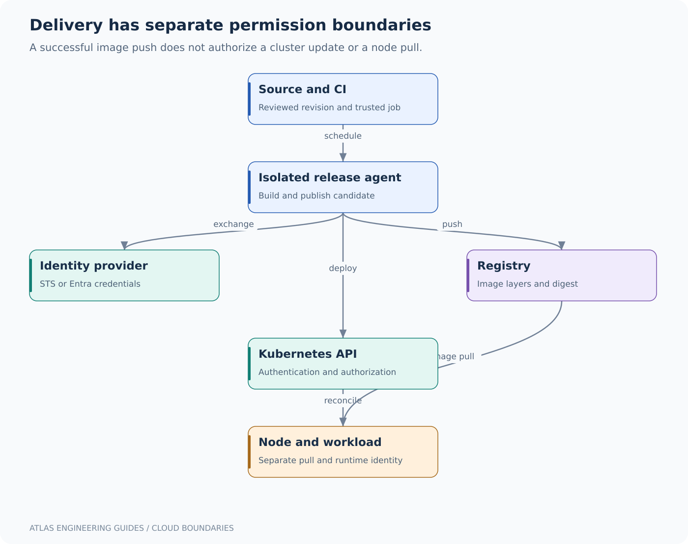

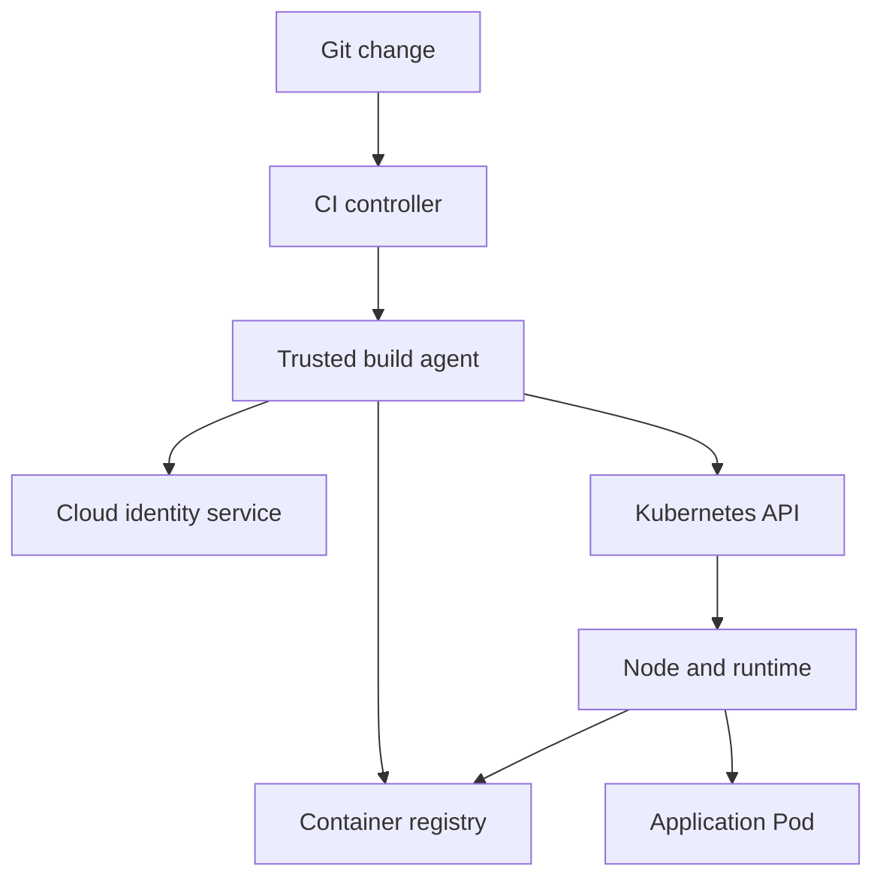
```mermaid
flowchart TD
    G[Git change] --> C[CI controller]
    C --> A[Trusted build agent]
    A --> I[Cloud identity service]
    A --> R[Container registry]
    A --> K[Kubernetes API]
    K --> N[Node and runtime]
    N --> R
    N --> P[Application Pod]
```

All messages below are **redacted, illustrative protocol examples**, not captured credentials or a claim that a deployment was performed. The scripts in the companion bundle use CLIs/SDK credential providers to implement signing and token refresh. Do not replace those providers with copied token strings.

<a id="section-25"></a>

## 16. From Git commit to an authorized build

### 16.1 Webhook delivery is a signal, not the source of truth

A Git provider sends an HTTPS POST containing repository and commit metadata. CI checks the signature/token using the provider's documented scheme, checks the repository/ref against configured rules and schedules a build. It should fetch the exact authorized revision from Git rather than executing arbitrary shell text in the payload.

```http
POST /configured-webhook-endpoint HTTP/1.1
Host: ci.example.com
Content-Type: application/json
X-Provider-Delivery: delivery-42
X-Provider-Signature: REDACTED_PROVIDER_SPECIFIC_SIGNATURE

{"repository":"engineering/atlas","ref":"refs/heads/main","after":"COMMIT_SHA"}
```

Header names here intentionally describe the concept; GitHub, GitLab, Azure Repos and CI plugins use their own exact endpoint/header contracts. Do not implement a handler that assumes these illustrative names are a standard.

Duplicate delivery is normal in a retrying system. Deduplicate by delivery ID where useful and make build scheduling/promotion robust to duplicate events. A webhook acknowledgement means “event accepted,” not “deployment completed.” Polling can recover missed notifications if the integration supports it.

### 16.2 Git transport and dependency transport

Git over HTTPS typically authenticates using a scoped token/app credential; SSH authenticates a user/key and validates the server's host key. Disabling host-key validation to “fix checkout” removes a meaningful server-authentication check. Maven/Python dependency downloads are separate HTTPS connections with their own repositories and credentials.

A build can have a valid Git token yet fail because an internal Maven repository certificate is not trusted by the JVM. Compare OS trust, Java trust and container trust; they may not be identical. Similarly, an HTTP proxy that works for `curl` may not be configured for Maven, Docker's daemon or the cloud CLI.

### 16.3 Agent trust and ephemeral execution

Use isolated agents for untrusted pull requests and trusted releases. A temporary credential still grants access to malicious code while it is valid. Destroy or scrub workspaces, Docker credentials and cloud CLI state after a privileged build. Avoid concurrent untrusted builds under the same OS account or on a shared privileged Docker socket.

Agents usually need outbound access to the controller, Git, package repositories, identity endpoints and artifact services. Inbound ports depend on how the controller launches/connects agents. Jenkins supports multiple agent connection models, including SSH launch and inbound agent connections; inspect the installed configuration rather than assuming one fixed “Jenkins port.” See [Jenkins agents](https://www.jenkins.io/doc/book/using/using-agents/).

<a id="section-26"></a>

## 17. AWS identity: credential provider chains and STS

### 17.1 Three practical ways a build gets AWS credentials

| Build location | Initial identity | Exchange | Good use |
|---|---|---|---|
| Trusted EC2 agent | Instance profile via IMDSv2 | Optional `AssumeRole` into target account | Jenkins/TeamCity agents hosted in AWS |
| CI with a supported OIDC issuer | Signed workload JWT | `AssumeRoleWithWebIdentity` | GitHub/GitLab or another explicitly configured issuer |
| TeamCity AWS connection | Configured connection/provider chain | TeamCity obtains credentials for selected role | Centralized TeamCity project integration |

These are alternatives. A generic Jenkins job or TeamCity build does **not** automatically receive a trustworthy OIDC token just because GitHub Actions does. You must have a real issuer and configure its trust relationship. For a first implementation, a narrowly privileged AWS-hosted agent plus role assumption is often easier to explain and operate.

The SDK/CLI credential chain can find environment credentials, a shared credentials/config file, web-identity configuration, container credentials or instance credentials depending on tool/version. Stale environment variables can take precedence over the intended instance profile. Check `aws sts get-caller-identity` and the configured profile when the principal is unexpected; do not print credential values.

### 17.2 IMDSv2: the local metadata boundary

An EC2 process first obtains an IMDSv2 session token using a local HTTP PUT, then presents that token to metadata GET requests. The metadata token is **not** an AWS API access token. A role-credentials response contains an access-key ID, secret access key, session token and expiration; the SDK uses those for later API signing. IMDS is a link-local service, and hop-limit/container/network configuration affects reachability. See [EC2 IMDSv2](https://docs.aws.amazon.com/AWSEC2/latest/UserGuide/configuring-instance-metadata-service.html).

```http
PUT /latest/api/token HTTP/1.1
Host: 169.254.169.254
X-aws-ec2-metadata-token-ttl-seconds: 21600

HTTP/1.1 200 OK

REDACTED_IMDS_SESSION_TOKEN
```

The next request carries `X-aws-ec2-metadata-token` and asks for the configured IAM-role metadata. Require IMDSv2 and restrict which workloads can reach credentials. A process that can access a powerful instance profile can act with that power even if its CI job did not explicitly bind a secret.

### 17.3 Cross-account role assumption

Account A runs the CI agent under `CiAgentBootstrap`. Account B holds the ECR repository and EKS cluster. Bootstrap policy permits only `sts:AssumeRole` on `AtlasReleaseRole` in B. B's role trust policy permits that principal, optionally with the configured external-ID condition. The release role's permissions determine allowed API actions after assumption.

```json
{
  "Version": "2012-10-17",
  "Statement": [{
    "Effect": "Allow",
    "Principal": {"AWS": "arn:aws:iam::111122223333:role/CiAgentBootstrap"},
    "Action": "sts:AssumeRole",
    "Condition": {"StringEquals": {"sts:ExternalId": "configured-project-external-id"}}
  }]
}
```

The external ID is a confused-deputy control, not a password that replaces principal validation. Role chaining can constrain session duration; set durations according to the actual assumption path and API rules. Build time and credential lifetime must be compatible, or the release can fail after tests finish but before deployment begins.

### 17.4 OIDC to AWS: the precise exchange

A CI issuer signs a JWT. AWS checks its issuer, signature, audience, expiry and configured subject conditions against the IAM OIDC provider and role trust policy. `AssumeRoleWithWebIdentity` returns temporary AWS credentials; the original JWT is not sent as a Bearer token to ECR or EKS management APIs. See [STS web-identity API](https://docs.aws.amazon.com/STS/latest/APIReference/API_AssumeRoleWithWebIdentity.html).

```http
POST / HTTP/1.1
Host: sts.us-east-1.amazonaws.com
Content-Type: application/x-www-form-urlencoded

Action=AssumeRoleWithWebIdentity&Version=2011-06-15&RoleArn=URL_ENCODED_ROLE_ARN&RoleSessionName=atlas-build-42&WebIdentityToken=REDACTED_JWT
```

```xml
<AssumeRoleWithWebIdentityResponse>
  <AssumeRoleWithWebIdentityResult>
    <Credentials>
      <AccessKeyId>REDACTED</AccessKeyId>
      <SecretAccessKey>REDACTED</SecretAccessKey>
      <SessionToken>REDACTED</SessionToken>
      <Expiration>ILLUSTRATIVE_EXPIRATION</Expiration>
    </Credentials>
  </AssumeRoleWithWebIdentityResult>
</AssumeRoleWithWebIdentityResponse>
```

This simplified XML omits namespaces and other response elements. The AWS CLI can display JSON even when the underlying API uses an XML response. CLI output format and wire protocol are different layers.

For GitHub, restrict the role trust to the intended repository and branch or protected environment, with the expected audience. An environment-based subject differs from a branch-based subject; use the actual claim shape. See [GitHub OIDC to AWS](https://docs.github.com/en/actions/how-tos/secure-your-work/security-harden-deployments/oidc-in-aws).

<a id="section-27"></a>

## 18. AWS request signing, ECR and registry messages

### 18.1 What SigV4 does

AWS Signature Version 4 authenticates requests by signing a canonical representation. Conceptually: normalize method/path/query/selected headers and payload hash; hash that canonical request; construct a string-to-sign including timestamp and credential scope; derive a signing key through date, region and service; compute the signature. Temporary credentials additionally require the session token. TLS still protects transport confidentiality and server identity. See [AWS request signing](https://docs.aws.amazon.com/IAM/latest/UserGuide/reference_sigv-create-signed-request.html).

```http
POST / HTTP/1.1
Host: api.ecr.us-east-1.amazonaws.com
Content-Type: application/x-amz-json-1.1
X-Amz-Target: AmazonEC2ContainerRegistry_V20150921.GetAuthorizationToken
X-Amz-Date: 20260917T120000Z
X-Amz-Security-Token: REDACTED_SESSION_TOKEN
Authorization: AWS4-HMAC-SHA256 Credential=REDACTED/20260917/us-east-1/ecr/aws4_request, SignedHeaders=REDACTED, Signature=REDACTED

{}
```

This header is intentionally not a valid signature example. In production use the AWS CLI/SDK. Common signature failures include wrong region/service, clock skew, a changed signed header, wrong payload bytes and missing session token. A proxy that rewrites signed content can break an otherwise valid request.

### 18.2 ECR login is another credential exchange

ECR returns an authorization token and proxy endpoint. The token represents registry credentials, and its validity is documented as 12 hours; permissions remain tied to the IAM principal. The Docker username is `AWS`, and the password is obtained through `aws ecr get-login-password`. Do not confuse that password with the IAM secret access key. See [ECR GetAuthorizationToken](https://docs.aws.amazon.com/AmazonECR/latest/APIReference/API_GetAuthorizationToken.html).

```bash
aws ecr get-login-password --region "$AWS_REGION" |
  docker login --username AWS --password-stdin "$ECR_REGISTRY"
```

`--password-stdin` avoids embedding the password in command-line arguments. Keep shell tracing off and use a build-specific Docker config directory. A Docker config file may contain reusable authentication material, so it must not be archived with build outputs.

### 18.3 Image push: blobs first, manifest last

An image consists of content-addressed blobs and a manifest that references them. Registry API clients often check whether blobs already exist, initiate uploads only for missing data, upload bytes and commit a manifest. Actual exchanges vary with chunking, redirects, cross-repository mounts and registry implementation. The [Distribution API](https://distribution.github.io/distribution/spec/api/) defines the underlying concepts.

| Step | Illustrative message | Typical successful meaning |
|---|---|---|
| Check blob | `HEAD /v2/atlas/blobs/sha256:DIGEST` | `200`: blob exists; `404`: upload needed |
| Start upload | `POST /v2/atlas/blobs/uploads/` | `202` and upload location |
| Send bytes | `PATCH <upload-location>` | Upload offset/location advances |
| Commit blob | `PUT <upload-location>?digest=sha256:DIGEST` | `201`: content verified/committed |
| Commit image | `PUT /v2/atlas/manifests/COMMIT_TAG` | Manifest stored, digest available |

A layer upload can succeed while manifest publication fails. Do not mark the release published until the manifest/image digest is confirmed. The companion script resolves the ECR image digest after push and writes `release-image.txt`; deployment consumes that immutable reference.

### 18.4 Least-privilege push permissions

ECR push typically needs layer-upload operations, layer availability checks and `PutImage` on the selected repository. `GetAuthorizationToken` uses resource `*`; repository-specific operations can be scoped. The example script also uses `DescribeImages` to resolve the digest, which must be allowed. Include pull/read operations only where required by the client/build workflow. See [ECR push IAM permissions](https://docs.aws.amazon.com/AmazonECR/latest/userguide/image-push-iam.html).

Do not grant `ecr:*` across every repository merely because `GetAuthorizationToken` is unscoped. IAM authorization is evaluated per action/resource, not as one global “registry login permission.”

<a id="section-28"></a>

## 19. EKS connectivity: discovery, authentication and authorization

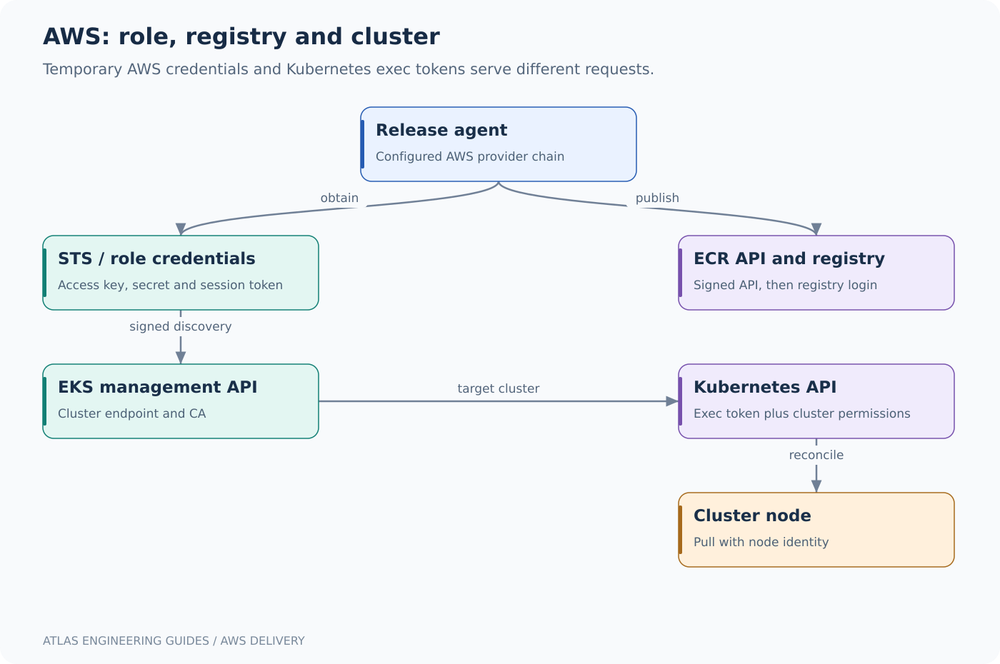

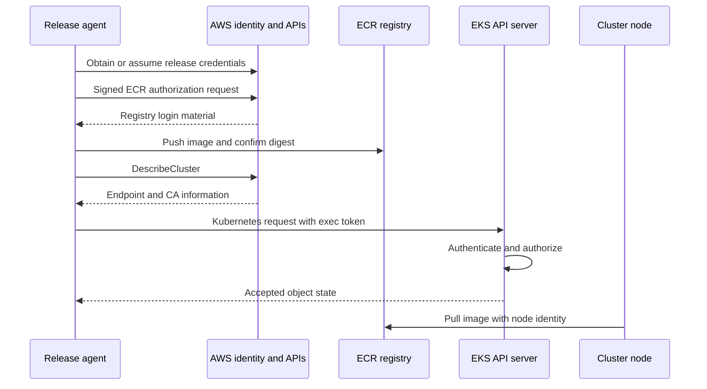
```mermaid
sequenceDiagram
    participant A as Release agent
    participant S as AWS identity and APIs
    participant R as ECR registry
    participant K as EKS API server
    participant N as Cluster node
    A->>S: Obtain or assume release credentials
    A->>S: Signed ECR authorization request
    S-->>A: Registry login material
    A->>R: Push image and confirm digest
    A->>S: DescribeCluster
    S-->>A: Endpoint and CA information
    A->>K: Kubernetes request with exec token
    K->>K: Authenticate and authorize
    K-->>A: Accepted object state
    N->>R: Pull image with node identity
```

### 19.1 `update-kubeconfig` does not grant cluster permissions

`aws eks update-kubeconfig` discovers cluster endpoint/certificate information and writes a kubeconfig containing an exec authentication command. It does not grant Kubernetes access. Cloud permission to describe the cluster, network reachability, authentication and Kubernetes authorization are four distinct prerequisites. See [EKS kubeconfig setup](https://docs.aws.amazon.com/eks/latest/userguide/create-kubeconfig.html).

```bash
aws eks update-kubeconfig \
  --region "$AWS_REGION" \
  --name "$EKS_CLUSTER" \
  --kubeconfig "$KUBECONFIG"
kubectl --namespace atlas auth can-i patch deployments
```

Use a per-build kubeconfig path. Shared `~/.kube/config` files allow concurrent jobs to overwrite contexts and accidentally target the wrong cluster.

### 19.2 The EKS token is not a generic OAuth token

`aws eks get-token` produces an `ExecCredential` response for kubectl. Its bearer token uses the `k8s-aws-v1.` format around an encoded, presigned STS request. The authenticator validates the AWS identity; the cluster identifier participates in replay protection. The implementation background is documented by [AWS IAM Authenticator](https://github.com/kubernetes-sigs/aws-iam-authenticator).

```json
{
  "apiVersion": "client.authentication.k8s.io/v1beta1",
  "kind": "ExecCredential",
  "status": {
    "expirationTimestamp": "ILLUSTRATIVE_EXPIRATION",
    "token": "k8s-aws-v1.REDACTED"
  }
}
```

Do not manually cache this token indefinitely. Let the exec plugin and supported clients handle renewal. A successful `get-token` command means token construction succeeded, not that the API server will authorize the desired operation.

### 19.3 Access entries and namespace permission

Modern EKS access entries connect IAM principals to cluster access configuration; details depend on the cluster's authentication mode and configured access policies/groups. A release principal should have the intended namespace/workload privileges, not an unrestricted administrator mapping. See [EKS access entries](https://docs.aws.amazon.com/eks/latest/userguide/access-entries.html).

For a narrow updater, Kubernetes permissions might include `get`, `patch` and `watch` for the intended Deployment plus reads needed to verify rollout. Creating Secrets, RBAC bindings or privileged Pods can indirectly grant broader powers; deploy rights are security-sensitive even if no IAM administrator role is involved.

### 19.4 The Kubernetes request and asynchronous outcome

```http
PATCH /apis/apps/v1/namespaces/atlas/deployments/atlas-api HTTP/1.1
Host: CLUSTER_ENDPOINT
Authorization: Bearer REDACTED_EXEC_TOKEN
Content-Type: application/strategic-merge-patch+json

{"spec":{"template":{"spec":{"containers":[{"name":"api","image":"REGISTRY/atlas@sha256:VERIFIED_DIGEST"}]}}}}
```

This is an illustrative patch shape, not a claim that every kubectl command emits exactly these headers. A `200` means the API update was accepted. Controllers still need to create Pods, nodes must pull images, the process must start and readiness must pass. `kubectl rollout status` observes progress; an application-level smoke test and quality checks establish the user-facing result.

<a id="section-29"></a>

## 20. Azure identity: managed identity and workload federation

### 20.1 Four Azure identifiers people confuse

| Identifier | Meaning | Typical use |
|---|---|---|
| Tenant ID | Entra directory | Token authority selection |
| Subscription ID | Azure resource-management boundary | Select target subscription/resource IDs |
| Client/application ID | Application or managed-identity client identifier | Select identity at login |
| Principal/object ID | Directory object used for role assignment | Grant resource permissions |

An Azure DevOps repository token is not automatically a token for Azure Resource Manager. An Entra token for ARM is not automatically an AKS API token or a registry access token. The intended audience/resource and role assignments must match the target service.

### 20.2 Azure-hosted Jenkins or TeamCity agent

A dedicated Azure VM agent can use managed identity. The VM metadata endpoint issues a token for a requested resource. A user-assigned managed identity is selected explicitly when multiple identities are present. The local metadata call uses HTTP with the `Metadata: true` header; it is not a public endpoint and should not be routed through an external proxy. See [VM managed-identity token flow](https://learn.microsoft.com/en-us/entra/identity/managed-identities-azure-resources/how-to-use-vm-token).

```http
GET /metadata/identity/oauth2/token?api-version=2018-02-01&resource=https%3A%2F%2Fmanagement.azure.com%2F&client_id=CLIENT_ID HTTP/1.1
Host: 169.254.169.254
Metadata: true
```

```json
{"access_token":"REDACTED","expires_in":"ILLUSTRATIVE_SECONDS","token_type":"Bearer","resource":"https://management.azure.com/"}
```

In a pipeline, use `az login --identity --client-id "$AZURE_CLIENT_ID"` and then `az account set --subscription "$AZURE_SUBSCRIPTION_ID"`. Assign the identity to the VM beforehand; the login command cannot create that trust relationship. Give untrusted PR agents a different identity or none.

### 20.3 External workload assertion to Entra token

For a supported external CI issuer, configure an Entra federated identity credential matching **issuer, subject and audience**. The CI-issued JWT is supplied as a client assertion in an OAuth client-credentials token request. Entra validates that assertion and issues an access token for the requested scope/resource. See [Microsoft client-credentials flow](https://learn.microsoft.com/en-us/entra/identity-platform/v2-oauth2-client-creds-grant-flow).

```http
POST /TENANT_ID/oauth2/v2.0/token HTTP/1.1
Host: login.microsoftonline.com
Content-Type: application/x-www-form-urlencoded

client_id=CLIENT_ID&grant_type=client_credentials&scope=https%3A%2F%2Fmanagement.azure.com%2F.default&client_assertion_type=urn%3Aietf%3Aparams%3Aoauth%3Aclient-assertion-type%3Ajwt-bearer&client_assertion=REDACTED_EXTERNAL_JWT
```

The external assertion audience commonly used by Azure federation is `api://AzureADTokenExchange`; the resulting ARM access token has a different intended resource. Do not confuse the assertion's audience with the token you are asking Entra to issue. Exact supported federation features differ by identity type and CI integration.

For GitHub use the supported Azure login action and configured federation; for Azure Pipelines use a workload-identity-federated ARM service connection. Neither requires inventing a long-lived client secret for the build. Sources: [GitHub to Azure OIDC](https://learn.microsoft.com/en-us/azure/developer/github/connect-from-azure-openid-connect) and [Azure Pipelines ARM service connections](https://learn.microsoft.com/en-us/azure/devops/pipelines/library/connect-to-azure?view=azure-devops).

<a id="section-30"></a>

## 21. ACR: Entra authentication becomes registry authorization

An ACR login uses Entra authentication and registry-specific token exchanges. A client may first receive a registry Bearer challenge, exchange an Entra token for an ACR refresh token, and request a repository-scoped access token. These registry tokens have different roles from an ARM management token. The official [ACR OAuth walkthrough](https://github.com/Azure/acr/blob/main/docs/AAD-OAuth.md) documents that separation.

```http
GET /v2/ HTTP/1.1
Host: exampleacr.azurecr.io

HTTP/1.1 401 Unauthorized
WWW-Authenticate: Bearer realm="https://exampleacr.azurecr.io/oauth2/token",service="exampleacr.azurecr.io"
```

```http
POST /oauth2/exchange HTTP/1.1
Host: exampleacr.azurecr.io
Content-Type: application/x-www-form-urlencoded

grant_type=access_token&service=exampleacr.azurecr.io&tenant=TENANT_ID&access_token=REDACTED_ENTRA_TOKEN
```

```http
POST /oauth2/token HTTP/1.1
Host: exampleacr.azurecr.io
Content-Type: application/x-www-form-urlencoded

grant_type=refresh_token&service=exampleacr.azurecr.io&scope=repository%3Aatlas%3Apull%2Cpush&refresh_token=REDACTED_ACR_REFRESH_TOKEN
```

A `401` challenge at the first registry probe is often a normal part of authentication. A repeated `401` after the token exchange is a failure. The push itself then uses the registry blob/manifest operations already explained for ECR.

For practical builds, use `az acr login --name "$ACR_NAME"`, which integrates with Docker. If you use `--expose-token`, treat the output as a secret and avoid printing the returned JSON. The normal login path is simpler when Docker is available. See [ACR managed-identity authentication](https://learn.microsoft.com/en-us/azure/container-registry/container-registry-authentication-managed-identity).

### 21.1 Registry roles depend on the permission mode

Traditional registry RBAC commonly uses `AcrPush` and `AcrPull`. Registries configured for repository-level ABAC use a different role model, including repository reader/writer roles and applicable conditions; do not blindly copy an `AcrPush` assignment into a different permission mode. Confirm the registry mode and required actions in [ACR role documentation](https://learn.microsoft.com/en-us/azure/container-registry/container-registry-rbac-built-in-roles-overview).

The publisher identity needs push access. AKS's kubelet/runtime identity needs pull access. Granting one does not grant the other. A private registry additionally requires a working network/DNS path from the node, not only from the CI agent.

<a id="section-31"></a>

## 22. AKS: ARM discovery, kubelogin and cluster authorization

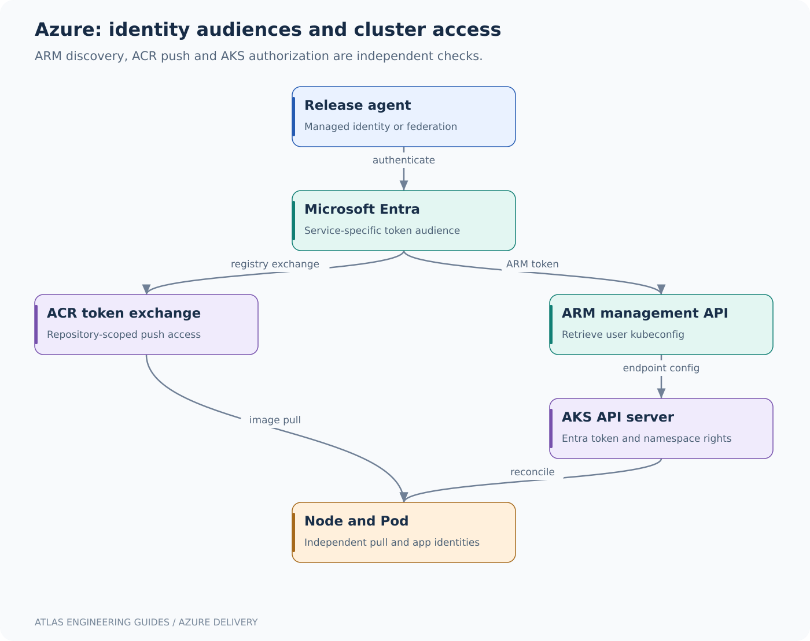

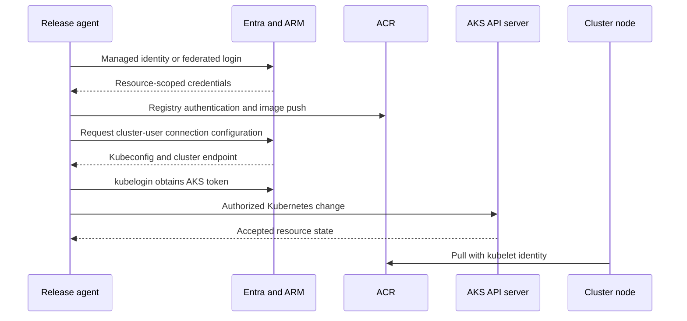
```mermaid
sequenceDiagram
    participant A as Release agent
    participant E as Entra and ARM
    participant R as ACR
    participant K as AKS API server
    participant N as Cluster node
    A->>E: Managed identity or federated login
    E-->>A: Resource-scoped credentials
    A->>R: Registry authentication and image push
    A->>E: Request cluster-user connection configuration
    E-->>A: Kubeconfig and cluster endpoint
    A->>E: kubelogin obtains AKS token
    A->>K: Authorized Kubernetes change
    K-->>A: Accepted resource state
    N->>R: Pull with kubelet identity
```

### 22.1 Three permissions, not one

1. **Management plane:** permission to retrieve cluster-user credentials/configuration from the AKS resource.
2. **Authentication:** a valid Entra token for the AKS API's expected audience.
3. **Authorization:** either the configured Azure authorization integration or Kubernetes RBAC permits the requested action.

The Azure Kubernetes Service Cluster User Role facilitates obtaining user kubeconfig; it is not a synonym for unrestricted Kubernetes administrator. The cluster's authorization mode controls how subsequent API actions are permitted. See [AKS authorization](https://learn.microsoft.com/en-us/azure/aks/manage-azure-rbac).

```bash
az aks get-credentials \
  --resource-group "$AKS_RESOURCE_GROUP" \
  --name "$AKS_CLUSTER" \
  --file "$KUBECONFIG" --overwrite-existing
kubelogin convert-kubeconfig -l azurecli
kubectl --namespace atlas auth can-i patch deployments
```

This flow assumes the build has already authenticated with Azure CLI and the cluster supports the selected Entra flow. `kubelogin` must be installed. For managed-identity or workload-identity-specific modes, choose and test the documented mode deliberately. Avoid `--admin` as a shortcut around identity design. See [AKS kubelogin](https://learn.microsoft.com/en-us/azure/aks/kubelogin-authentication).

### 22.2 Management request versus Kubernetes request

The management API includes an operation shaped like:

```http
POST /subscriptions/SUBSCRIPTION/resourceGroups/GROUP/providers/Microsoft.ContainerService/managedClusters/CLUSTER/listClusterUserCredential?api-version=SUPPORTED_VERSION HTTP/1.1
Host: management.azure.com
Authorization: Bearer REDACTED_ARM_TOKEN
```

The later workload update goes to the cluster API endpoint, not `management.azure.com`, and carries an AKS-valid token. An ARM `403` and a Kubernetes `403` are different authorization failures. Capture the target host, operation, principal and correlation ID to determine which permission is missing.

<a id="section-32"></a>

## 23. Network connectivity: private does not mean automatically reachable

DNS resolution, routing, firewall rules, TLS trust and service authorization all have to work. Test them in that order when a connection never reaches application authentication. A hosted public CI runner cannot necessarily reach a private cluster endpoint; place a controlled self-hosted agent on an approved network path or use a supported private-network integration.

| Dependency | AWS example | Azure example | Frequent failure |
|---|---|---|---|
| Identity API | Regional STS endpoint | Entra endpoint / VM metadata | Egress blocked or proxy misconfigured |
| Registry control/auth | ECR API endpoint | ACR authentication endpoint | Private DNS missing |
| Registry image data | ECR registry plus required storage path | ACR registry/data endpoints | Login works but layers cannot transfer |
| Cluster management | EKS service API | ARM | IAM/RBAC or network deny |
| Cluster data plane | EKS API endpoint | AKS API endpoint | Private route absent |
| Runtime pull | Node network to ECR/storage | Node network to ACR | CI can reach it, nodes cannot |

For private ECR access, account for the ECR API and Docker registry endpoints and required S3 access for layers, according to your runtime/setup. For private ACR, configure the required private endpoint DNS and registry/data endpoint paths. Sources: [ECR VPC endpoints](https://docs.aws.amazon.com/AmazonECR/latest/userguide/vpc-endpoints.html), [ACR private endpoints](https://learn.microsoft.com/en-us/azure/container-registry/container-registry-private-link).

### 23.1 A useful diagnostic trace

Suppose `docker login` works but `docker push` times out during layer upload. Check the upload location returned by the registry, the destination hostname after redirects, proxy behavior and storage endpoint routing. Do not immediately rotate credentials: the successful authentication provides evidence that the first boundary worked.

Suppose `kubectl` hangs rather than returns `401/403`. Check cluster DNS and TCP/TLS reachability before RBAC. Suppose it returns `403 Forbidden` naming your expected principal: transport and authentication likely succeeded; inspect authorization. Error classification is faster than changing every permission at once.

<a id="section-33"></a>

## 24. TeamCity: controller settings, agents, build chains and messages

### 24.1 What runs where

The TeamCity server manages projects, VCS roots, configuration, queueing and build records. Agents execute build steps in workspaces and report progress. A VCS root describes source access; an AWS connection describes AWS access; an agent cloud profile provisions execution capacity. These objects solve different problems.

Kotlin DSL is configuration-as-code evaluated to create TeamCity settings. It is not the shell executing inside the build. Runtime work belongs in build steps/scripts. Use the DSL version and generated Maven project that match your server. Current TeamCity documentation also describes newer pipeline configuration formats; this guide uses classic BuildType/Kotlin DSL for an explicit, recognizable model. See [TeamCity Kotlin DSL](https://www.jetbrains.com/help/teamcity/kotlin-dsl.html).

### 24.2 AWS connection to build credentials

Configure an AWS connection backed by a narrowly privileged role/provider chain, allow the intended builds to use it, then add the **AWS Credentials** build feature. TeamCity makes credentials available through a build-specific file referenced by `AWS_SHARED_CREDENTIALS_FILE`; profiles matter if multiple connections are injected. Temporary credential session duration must cover the privileged phase. See [AWS Credentials build feature](https://www.jetbrains.com/help/teamcity/aws-credentials.html).

```kotlin
import jetbrains.buildServer.configs.kotlin.*
import jetbrains.buildServer.configs.kotlin.buildFeatures.provideAwsCredentials
import jetbrains.buildServer.configs.kotlin.buildSteps.script

version = "2025.11" // Use the version exported by your installed server.

project { buildType(AtlasAwsRelease) }

object AtlasAwsRelease : BuildType({
    name = "Atlas - trusted AWS release"
    vcs { root(DslContext.settingsRoot) }
    artifactRules = "release-image.txt"
    params {
        param("env.AWS_REGION", "us-east-1")
        param("env.AWS_ACCOUNT_ID", "111122223333")
        param("env.ECR_REPOSITORY", "atlas")
        param("env.LOCAL_IMAGE", "atlas-ci:candidate")
    }
    features {
        provideAwsCredentials { awsConnectionId = "AtlasReleaseRoleConnection" }
    }
    steps {
        script {
            name = "Build, test and publish"
            scriptContent = """
                set -eu
                python3 -m unittest discover -s code/python -p 'test_*.py'
                java code/java-core/AtlasCore.java
                docker build -t atlas-ci:candidate code/spring
                export IMAGE_TAG="%build.vcs.number%"
                bash delivery/publish_aws.sh
            """.trimIndent()
        }
    }
})
```

This expects the source bundle layout, installed tools and a preconfigured connection ID. It is an adaptation template, not a complete TeamCity server configuration. Grant release builds only to trusted refs/settings and use an isolated trusted agent pool. Do not enable this credential feature for untrusted pull-request code.

### 24.3 Azure connection choices in TeamCity

An Azure DevOps VCS connection gives TeamCity source/project access; it does not automatically authorize Azure subscription resources. For release steps on a trusted Azure VM agent, use managed identity and the `az` CLI. For an external agent, use a deliberately configured federation mechanism supported by your installation, or a scoped, rotated credential stored as a protected parameter. Do not assume a built-in generic TeamCity OIDC issuer from an unrelated plugin example. See [TeamCity connection types](https://www.jetbrains.com/help/teamcity/configuring-connections.html).

The Azure build step can run the same test/build operations and then `bash delivery/publish_azure.sh`. Set `AZURE_CLIENT_ID`, `AZURE_SUBSCRIPTION_ID`, `ACR_NAME`, `ACR_LOGIN_SERVER`, `ACR_REPOSITORY` and the candidate image/tag as non-secret configuration. The managed-identity assignment and role permissions are provisioned separately.

### 24.4 Snapshot dependencies versus artifact dependencies

A snapshot dependency coordinates compatible revisions/build ordering across a chain. An artifact dependency transfers selected outputs from an upstream build. Use both appropriately: “deploy after tests” is not enough if deployment downloads an unrelated last-successful artifact. Tie the release image/digest and evaluation report to the exact approved upstream run. See [TeamCity build chains](https://www.jetbrains.com/help/teamcity/build-chain.html).

For a large image, use the registry as the artifact store and pass a small signed/verified release record. Passing a gigabyte Docker tar through every CI server can become a bottleneck. The record should include source revision, image digest, evaluation revision and target-compatible schema/index contract.

### 24.5 TeamCity service messages are a log protocol

Build scripts can emit specially formatted service messages that TeamCity interprets as structured events. These are neither AWS API messages nor generic shell comments. A test adapter can report a test start/failure/end, attach artifacts or report statistics. See [TeamCity service messages](https://www.jetbrains.com/help/teamcity/service-messages.html).

```text
##teamcity[testStarted name='retrieval.tenantIsolation']
##teamcity[testFailed name='retrieval.tenantIsolation' message='Unexpected document' details='Expected acme-only evidence']
##teamcity[testFinished name='retrieval.tenantIsolation' duration='12']
##teamcity[buildStatisticValue key='rag.recallAt5' value='0.92']
```

Escape untrusted attribute text. The important escape sequences include `||` for a literal pipe, `|'` for a quote, `|n` for newline, `|r` for carriage return and `|[`/`|]` for brackets. The companion `teamcity_messages.py` implements and tests escaping. Without it, document text or test names can accidentally become control messages. Test execution should still exit nonzero when required checks fail; reporting a statistic alone is not a quality gate.

<a id="section-34"></a>

## 25. Jenkins: controller, agents, credentials and the Jenkinsfile

### 25.1 Pipeline execution model

The controller loads the Jenkinsfile and coordinates pipeline state; agents execute workspace steps. Declarative pipeline defines stages, conditions and post-actions. External scripts keep cloud commands testable outside Jenkins. Plugin steps add behavior but also a compatibility/security maintenance responsibility. The [Jenkinsfile guide](https://www.jenkins.io/doc/book/pipeline/jenkinsfile/) explains the model.

A trusted AWS agent can use its instance role/provider chain without storing IAM access keys in Jenkins. A trusted Azure VM agent can use managed identity. Restrict which jobs can run on those agents: labels are scheduling selectors, not a complete authorization boundary. Configure job/folder permissions and agent isolation accordingly.

### 25.2 AWS Jenkinsfile

```groovy
pipeline {
  agent { label 'trusted-aws-release' }
  options {
    timestamps()
    disableConcurrentBuilds()
    timeout(time: 30, unit: 'MINUTES')
  }
  environment {
    AWS_REGION = 'us-east-1'
    AWS_ACCOUNT_ID = '111122223333'
    ECR_REPOSITORY = 'atlas'
    LOCAL_IMAGE = 'atlas-ci:candidate'
  }
  stages {
    stage('Checkout') { steps { checkout scm } }
    stage('Contracts') {
      steps {
        sh 'python3 -m unittest discover -s code/python -p "test_*.py"'
        sh 'java code/java-core/AtlasCore.java'
      }
    }
    stage('Build candidate') {
      steps {
        script { env.IMAGE_TAG = sh(script: 'git rev-parse HEAD', returnStdout: true).trim() }
        sh 'docker build -t "$LOCAL_IMAGE" code/spring'
      }
    }
    stage('Publish') { steps { sh 'bash delivery/publish_aws.sh' } }
  }
  post {
    success { archiveArtifacts artifacts: 'release-image.txt', fingerprint: true }
    always { deleteDir() }
  }
}
```

This is a **trusted release job**, not a permission design for arbitrary multibranch PR execution. Run publication only after the repository/job policy admits the revision. It intentionally stops at publication; a protected deployment job or GitOps promotion consumes the digest. `disableConcurrentBuilds` serializes this job, not every deployment job in the organization.

The Docker build runs Maven through the supplied multi-stage Dockerfile. Image tags based on commit are easy to correlate, but enforce immutability and resolve the digest; a commit tag can still be overwritten in a mutable registry.

### 25.3 Azure Jenkinsfile variation

Select a trusted Azure-hosted agent, set Azure/ACR parameters and call `publish_azure.sh` after the same candidate build. That script calls managed-identity login and ACR login before push. Do not carry cached Azure CLI sessions from one job to the next: use a job-specific `AZURE_CONFIG_DIR` and clean it.

If a deployment is part of Jenkins, use a distinct protected job with a release ID/digest input drawn from an approved artifact. Avoid asking a production deploy job to check out and execute arbitrary scripts from an untrusted branch. The release's deployment logic is itself privileged code.

### 25.4 Plugin credentials versus native CLI identity

The Pipeline AWS Steps plugin provides operations such as `withAWS` and role assumption. Credential lookup can occur on the controller or node depending on configuration; inspect `useNode` and global settings for the installed plugin. Do not assume the agent's instance role is used when the plugin is resolving controller credentials. See [Pipeline AWS Steps](https://plugins.jenkins.io/pipeline-aws/).

For generic secret binding, `withCredentials` scopes environment access but is not a sandbox against malicious build code. Prefer shell expansion inside single-quoted Groovy script strings so Groovy does not interpolate secrets into step arguments. Avoid `set -x`; masking is best-effort and cannot prevent deliberate exfiltration. See [Jenkins credentials binding](https://www.jenkins.io/doc/pipeline/steps/credentials-binding/) and [credential security](https://www.jenkins.io/doc/book/security/credentials/).

<a id="section-35"></a>

## 26. Practical publisher/deployer scripts and their contracts

The companion `delivery/` directory contains four executable Bash scripts. They require pre-provisioned resources and trusted runner identities. They are syntax-checked locally, not cloud-executed. Run them first in a disposable environment after filling the documented parameters.

| Script | Input contract | Output | Deliberate boundary |
|---|---|---|---|
| `publish_aws.sh` | Local candidate image, region/account/repository/tag, working AWS identity | `release-image.txt` with ECR digest reference | Does not create IAM roles or registry |
| `publish_azure.sh` | Local candidate image, managed identity, subscription and ACR parameters | ACR digest reference | Assumes Azure VM identity assignment |
| `deploy_eks.sh` | Approved digest, cluster, namespace, Deployment/container | Rollout observation | Does not bootstrap namespace/RBAC |
| `deploy_aks.sh` | Approved digest, Azure identity and cluster parameters | Rollout observation | Uses user kubeconfig, not admin bypass |

The separation permits a release manager or GitOps controller to approve an immutable object rather than rebuilding source during deployment. The scripts validate basic input shapes and isolate credential/configuration files, but organization-specific policy must also verify registry allowlists, provenance, signatures, environment approvals and schema/index compatibility.

### 26.1 Promotion messages

```json
{
  "release_id": "atlas-42",
  "source_revision": "COMMIT_SHA",
  "image": "registry.example.com/atlas@sha256:VERIFIED_DIGEST",
  "prompt_version": "rollback-v4",
  "index_contract": "embedding-generation-g17",
  "evaluation_revision": "eval-2026-09-17",
  "target_environment": "production"
}
```

Sign or otherwise protect the release record according to your delivery system. A digest proves content identity; it does not prove that the artifact passed evaluation or that the requesting user may deploy it.

### 26.2 Rollback and concurrent releases

Two deployment jobs can race even if each script is correct. Use an environment-level lock or a GitOps source-of-truth workflow. Before promotion, check the expected current release, and record the transition. An older slow build must not overwrite a newer approved deployment accidentally.

After a timeout, query the actual Deployment state before retrying or rolling back. The API update might have succeeded while the client lost its response. Reapplying the same digest is usually convergent, but schema migrations, hooks and external side effects may not be. Keep those operations separately idempotent and observable.

### 26.3 Complete publisher and deployer implementations

The shared helper contains input checks, the exact repository allowlist and the rollout operation. The Azure examples deliberately use a user-assigned managed identity on an Azure VM agent. The AWS examples use the configured provider chain. Neither silently falls back to an administrator credential.

```bash
#!/usr/bin/env bash
# Sourced helpers. Intended for trusted, isolated Linux release agents.
set -euo pipefail
umask 077

require_env() {
  local name
  for name in "$@"; do
    [[ -n "${!name:-}" ]] || { printf 'Missing variable: %s\n' "$name" >&2; exit 2; }
  done
}

require_tools() {
  local tool
  for tool in "$@"; do command -v "$tool" >/dev/null || exit 2; done
}

valid_tag() {
  [[ "$1" =~ ^[a-zA-Z0-9_][a-zA-Z0-9_.-]{0,127}$ ]] || {
    printf 'Invalid image tag\n' >&2; exit 2;
  }
}

valid_repository() {
  [[ "$1" =~ ^[a-z0-9]+([._/-][a-z0-9]+)*$ ]] || {
    printf 'Repository must use the supported lowercase path form\n' >&2; exit 2;
  }
}

read_approved_image() {
  require_env APPROVED_REPOSITORY
  local release_file="${RELEASE_FILE:-release-image.txt}"
  IMAGE=$(cat -- "$release_file")
  [[ "$IMAGE" =~ ^[a-z0-9][a-z0-9./:_-]*@sha256:[a-f0-9]{64}$ ]] || {
    printf 'Expected one immutable image digest reference\n' >&2; exit 2;
  }
  [[ "${IMAGE%@*}" == "$APPROVED_REPOSITORY" ]] || {
    printf 'Image repository is outside the configured allowlist\n' >&2; exit 2;
  }
  # APPROVED_REPOSITORY comes from protected deployment config, not PR input.
}

deploy_image() {
  require_env NAMESPACE DEPLOYMENT CONTAINER
  kubectl auth can-i patch deployments.apps --namespace "$NAMESPACE" >/dev/null
  kubectl set image "deployment/$DEPLOYMENT" "$CONTAINER=$IMAGE" --namespace "$NAMESPACE"
  kubectl rollout status "deployment/$DEPLOYMENT" --namespace "$NAMESPACE" --timeout=180s
}
```

**AWS publication:** obtain a registry password, upload the existing candidate, resolve the immutable digest and produce a release artifact.

```bash
#!/usr/bin/env bash
set -euo pipefail
source "$(dirname -- "${BASH_SOURCE[0]}")/common.sh"
require_env AWS_REGION AWS_ACCOUNT_ID ECR_REPOSITORY LOCAL_IMAGE IMAGE_TAG
require_tools aws docker mktemp
[[ "$AWS_ACCOUNT_ID" =~ ^[0-9]{12}$ ]] || exit 2
[[ "$AWS_REGION" =~ ^[a-z]{2}-[a-z]+-[0-9]+$ ]] || exit 2
valid_tag "$IMAGE_TAG"
valid_repository "$ECR_REPOSITORY"
TASK_TMP=$(mktemp -d)
trap 'rm -rf -- "$TASK_TMP"' EXIT
export DOCKER_CONFIG="$TASK_TMP/docker"
mkdir -p "$DOCKER_CONFIG"
export AWS_PAGER=""
# Commercial AWS partition example; adapt endpoints for other partitions.
REGISTRY="$AWS_ACCOUNT_ID.dkr.ecr.$AWS_REGION.amazonaws.com"
REMOTE_IMAGE="$REGISTRY/$ECR_REPOSITORY:$IMAGE_TAG"
aws ecr get-login-password --region "$AWS_REGION" |
  docker login --username AWS --password-stdin "$REGISTRY"
docker tag "$LOCAL_IMAGE" "$REMOTE_IMAGE"
docker push "$REMOTE_IMAGE"
DIGEST=$(aws ecr describe-images --region "$AWS_REGION" \
  --registry-id "$AWS_ACCOUNT_ID" --repository-name "$ECR_REPOSITORY" \
  --image-ids "imageTag=$IMAGE_TAG" --query 'imageDetails[0].imageDigest' --output text)
[[ "$DIGEST" =~ ^sha256:[a-f0-9]{64}$ ]] || exit 3
# Registry tag immutability is a prerequisite for resolving this tag safely.
printf '%s@%s\n' "$REGISTRY/$ECR_REPOSITORY" "$DIGEST" > release-image.txt
printf 'Published immutable reference to release-image.txt\n'
```

**Azure publication:** isolate the CLI session, authenticate with the VM identity, verify the registry hostname, push and resolve the digest. Registry metadata read and image metadata read are prerequisites in addition to push.

```bash
#!/usr/bin/env bash
set -euo pipefail
source "$(dirname -- "${BASH_SOURCE[0]}")/common.sh"
require_env AZURE_CLIENT_ID AZURE_SUBSCRIPTION_ID ACR_NAME ACR_LOGIN_SERVER ACR_REPOSITORY LOCAL_IMAGE IMAGE_TAG
require_tools az docker mktemp
[[ "$ACR_NAME" =~ ^[a-zA-Z0-9]{5,50}$ ]] || exit 2
[[ "$ACR_LOGIN_SERVER" =~ ^[a-z0-9.-]+\.azurecr\.io$ ]] || exit 2
valid_tag "$IMAGE_TAG"
valid_repository "$ACR_REPOSITORY"
TASK_TMP=$(mktemp -d)
trap 'rm -rf -- "$TASK_TMP"' EXIT
export DOCKER_CONFIG="$TASK_TMP/docker"
export AZURE_CONFIG_DIR="$TASK_TMP/azure"
mkdir -p "$DOCKER_CONFIG" "$AZURE_CONFIG_DIR"
# User-assigned managed identity attached to this trusted Azure VM agent.
az login --identity --client-id "$AZURE_CLIENT_ID" --output none --only-show-errors
az account set --subscription "$AZURE_SUBSCRIPTION_ID"
ACTUAL_SERVER=$(az acr show --name "$ACR_NAME" --query loginServer --output tsv)
[[ "$ACTUAL_SERVER" == "$ACR_LOGIN_SERVER" ]] || exit 3
az acr login --name "$ACR_NAME" --only-show-errors
REMOTE_IMAGE="$ACR_LOGIN_SERVER/$ACR_REPOSITORY:$IMAGE_TAG"
docker tag "$LOCAL_IMAGE" "$REMOTE_IMAGE"
docker push "$REMOTE_IMAGE"
DIGEST=$(az acr repository show --name "$ACR_NAME" \
  --image "$ACR_REPOSITORY:$IMAGE_TAG" --query digest --output tsv)
[[ "$DIGEST" =~ ^sha256:[a-f0-9]{64}$ ]] || exit 3
# Enforce unique, non-overwritable release tags through registry/release policy.
printf '%s@%s\n' "$ACR_LOGIN_SERVER/$ACR_REPOSITORY" "$DIGEST" > release-image.txt
printf 'Published immutable reference to release-image.txt\n'
```

**EKS deployment:** discover the cluster using the configured deployment identity, create an isolated kubeconfig, enforce the configured repository and observe the update.

```bash
#!/usr/bin/env bash
set -euo pipefail
source "$(dirname -- "${BASH_SOURCE[0]}")/common.sh"
require_env AWS_REGION EKS_CLUSTER NAMESPACE DEPLOYMENT CONTAINER
require_tools aws kubectl mktemp
read_approved_image
TASK_TMP=$(mktemp -d)
trap 'rm -rf -- "$TASK_TMP"' EXIT
export KUBECONFIG="$TASK_TMP/kubeconfig"
export AWS_PAGER=""
# Existing AWS provider chain must resolve to the protected deployment role.
aws eks update-kubeconfig --region "$AWS_REGION" --name "$EKS_CLUSTER" \
  --kubeconfig "$KUBECONFIG" >/dev/null
deploy_image
```

**AKS deployment:** log in as the deployment VM identity, obtain non-admin kubeconfig, use the Azure CLI token flow through kubelogin, then update and observe the workload.

```bash
#!/usr/bin/env bash
set -euo pipefail
source "$(dirname -- "${BASH_SOURCE[0]}")/common.sh"
require_env AZURE_CLIENT_ID AZURE_SUBSCRIPTION_ID AKS_RESOURCE_GROUP AKS_CLUSTER NAMESPACE DEPLOYMENT CONTAINER
require_tools az kubelogin kubectl mktemp
read_approved_image
TASK_TMP=$(mktemp -d)
trap 'rm -rf -- "$TASK_TMP"' EXIT
export AZURE_CONFIG_DIR="$TASK_TMP/azure"
export KUBECONFIG="$TASK_TMP/kubeconfig"
mkdir -p "$AZURE_CONFIG_DIR"
az login --identity --client-id "$AZURE_CLIENT_ID" --output none --only-show-errors
az account set --subscription "$AZURE_SUBSCRIPTION_ID"
# Managed Entra integration is assumed. Never request --admin here.
az aks get-credentials --resource-group "$AKS_RESOURCE_GROUP" --name "$AKS_CLUSTER" \
  --file "$KUBECONFIG" --overwrite-existing --only-show-errors
kubelogin convert-kubeconfig -l azurecli
deploy_image
```

The scripts resolve a tag immediately after pushing. This requires protected, non-overwritable release tags and no conflicting publishers; otherwise another writer could change the tag before resolution. A stronger artifact workflow records the pushed manifest digest directly and verifies the release signature/provenance. Repository allowlisting in these examples does not replace that verification. The ACR metadata command is documented in [Azure CLI repository operations](https://learn.microsoft.com/en-us/cli/azure/acr/repository?view=azure-cli-latest#az-acr-repository-show).

<a id="section-36"></a>

## 27. Alternatives with concrete integration choices

### 27.1 GitHub Actions

Use the workflow's OIDC token capability to authenticate to AWS or Azure, with `id-token: write` only on jobs needing federation and `contents: read` for checkout. This permission allows requesting an identity token; it does not itself grant cloud access. Cloud trust policy provides that authorization. Use protected environments and reviewed action SHAs.

```yaml
permissions:
  contents: read
  id-token: write
jobs:
  publish:
    runs-on: ubuntu-latest
    environment: production
    steps:
      - uses: actions/checkout@v4
      - uses: aws-actions/configure-aws-credentials@v4
        with:
          role-to-assume: arn:aws:iam::111122223333:role/AtlasReleaseRole
          aws-region: us-east-1
      - run: aws sts get-caller-identity
```

Tags are readable teaching references; pin reviewed full SHAs for actual release use. This excerpt only demonstrates identity setup, not the complete build/publish/evaluation workflow. For Azure, use `azure/login` with client, tenant and subscription identifiers and configured federation, then the Azure CLI operations described earlier.

### 27.2 Azure Pipelines

An ARM service connection configured for workload identity federation supplies identity to an Azure task. Treat the connection as a protected resource, authorize only intended pipelines and scope its cloud roles. The YAML should reference the connection by name rather than embed a secret.

```yaml
steps:
  - task: AzureCLI@2
    inputs:
      azureSubscription: atlas-release-federated
      scriptType: bash
      scriptLocation: inlineScript
      inlineScript: |
        set -euo pipefail
        az account show --query '{subscription:id,tenant:tenantId}' -o json
        az acr login --name "$ACR_NAME"
    env:
      ACR_NAME: exampleacr
```

This task already authenticates through its service connection; do not invoke the VM-managed-identity login script inside it unless that is deliberately the chosen identity model. Reuse the registry push portion or adapt the script into authentication and publishing layers. A service connection name is a configuration reference, not a universally portable credential.

### 27.3 GitLab CI

GitLab jobs can request ID tokens with an audience configured for the cloud trust relationship. AWS validates the configured GitLab issuer/subject and audience before returning credentials. Use the job's supported `id_tokens` feature, not a legacy token copied from an unrelated example. See [GitLab AWS OIDC](https://docs.gitlab.com/ci/cloud_services/aws/).

```yaml
publish:
  id_tokens:
    AWS_ID_TOKEN:
      aud: sts.amazonaws.com
  script:
    - test -n "$AWS_ID_TOKEN"
    # Exchange through a configured credential helper/SDK; never echo the token.
```

The audience shown must match your registered provider and trust configuration. Protect release branches/environments and avoid exposing privileged runners to untrusted merge-request code.

### 27.4 CodeBuild, CodePipeline, Argo CD, Flux and Tekton

CodeBuild runs builds under a configured service role; its buildspec describes phases/artifacts. CodePipeline coordinates release stages. Their AWS-native identity integration can reduce external credential plumbing but does not eliminate permission scope or artifact provenance. See [CodeBuild buildspec](https://docs.aws.amazon.com/codebuild/latest/userguide/build-spec-ref.html).

Argo CD and Flux reconcile Kubernetes desired state from repositories; they complement a CI builder rather than necessarily replacing it. Tekton expresses pipeline tasks as Kubernetes resources and lets a platform team standardize execution inside clusters. Decide who owns runner updates, isolation, secrets, artifact storage and recovery before choosing a tool.

| Choice | Strong fit | Operational cost to account for |
|---|---|---|
| TeamCity | Existing JetBrains/enterprise build-chain ecosystem | Server/agent upgrades, connection and DSL governance |
| Jenkins | Flexible established plugin/shared-library ecosystem | Controller/plugin security and agent isolation |
| GitHub Actions | GitHub-centered review and OIDC releases | Runner trust and action dependency management |
| Azure Pipelines | Azure DevOps repos and protected service connections | Connection permissions and task/runtime versions |
| GitLab CI | Integrated GitLab pipeline/registry workflow | Runner boundary and token claim design |
| AWS-native pipeline | AWS-centric deployment estate | Service-role boundaries and pipeline coupling |
| GitOps controller | Auditable declarative cluster promotion | Reconciliation ownership and emergency-change process |

<a id="section-37"></a>

## 28. Troubleshooting workbook: reason from the failed boundary

**Case 1: AWS says `AccessDenied` on AssumeRole.** Confirm the source principal, source permission to call STS, target trust principal/conditions, external ID and any organizational explicit denies. Adding ECR permissions to the target role will not fix a trust failure that prevents entering that role.

**Case 2: TeamCity AWS credentials disappear after a long test stage.** The session may have expired before publishing. Move credential acquisition nearer the privileged phase or configure an appropriate supported session duration/renewal approach. Copying a temporary credential file to an artifact store is not a solution.

**Case 3: ECR login succeeds but push is denied.** Inspect repository-specific actions and target account/region. Authentication does not grant `PutImage` or upload permissions. Check whether the tool is pushing to the intended registry hostname.

**Case 4: Azure login succeeds but ACR push fails.** Check the identity's object ID, registry permission mode, repository conditions and propagation. A Contributor role on an unrelated resource group or a valid ARM token does not prove repository push access.

**Case 5: `get-credentials` succeeds but kubectl returns Forbidden.** Discovery permission worked; cluster authorization did not. Inspect EKS access entries or AKS/Kubernetes RBAC for the deployment principal. Avoid admin kubeconfig as a troubleshooting “fix.”

**Case 6: Registry push and Deployment update succeed, but the rollout times out.** Inspect node image-pull permissions/networking, manifest architecture, missing configuration, startup logs, resource scheduling and probe paths. CI credentials are no longer the only relevant credentials.

**Case 7: A deployment rolls back successfully but answers remain wrong.** Restore or select the compatible prompt/index generation and inspect cache dependencies. The container digest is one part of the AI release, not the complete behavioral state.

**Interview exercise:** explain every token in the AWS and Azure diagrams without using the phrase “the pipeline logs into the cloud.” For each exchange identify the issuer, recipient, audience/scope, expiration, storage location and authorizer. Then explain how a timeout differs from a denial and which operation can safely retry.

<a id="section-38"></a>

## 29. Under the agent connection: TCP, TLS, polling and Remoting

### 29.1 A full TLS connection before the cloud request

For a new HTTPS connection over TCP, DNS first resolves the intended hostname; the client opens a socket and exchanges SYN, SYN-ACK and ACK. A TLS 1.3 client then offers supported cryptographic parameters and a key share. The server selects parameters, proves its identity with a certificate/signature in a certificate-authenticated handshake, and both sides derive traffic secrets. Certificate chain and hostname validation matter separately: trusting a corporate CA does not justify accepting a certificate for the wrong host. Session resumption changes the exchange and can reduce setup work. TLS 1.3 does not use the old RSA key-transport handshake. [TLS 1.3 specification, RFC 9846](https://datatracker.ietf.org/doc/html/rfc9846).

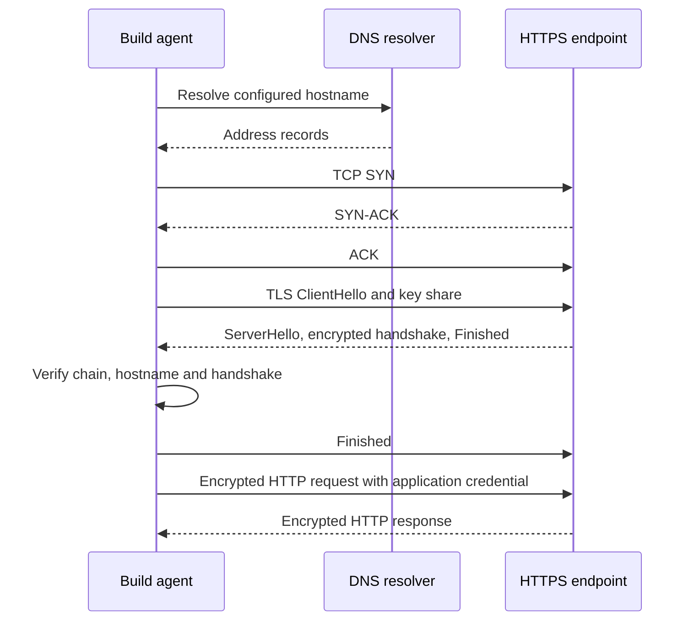
```mermaid
sequenceDiagram
    participant A as Build agent
    participant D as DNS resolver
    participant E as HTTPS endpoint
    A->>D: Resolve configured hostname
    D-->>A: Address records
    A->>E: TCP SYN
    E-->>A: SYN-ACK
    A->>E: ACK
    A->>E: TLS ClientHello and key share
    E-->>A: ServerHello, encrypted handshake, Finished
    A->>A: Verify chain, hostname and handshake
    A->>E: Finished
    A->>E: Encrypted HTTP request with application credential
    E-->>A: Encrypted HTTP response
```

This diagram groups TLS server handshake messages to keep the sequence readable. A normal server-authenticated TLS connection does not require a client certificate; CI/cloud authentication often happens afterward through an agent credential, bearer token or SigV4 signature. Mutual TLS adds a client-certificate identity boundary only when configured. An HTTP proxy using CONNECT and a TLS-terminating reverse proxy produce different network traces; identify which endpoint actually presents the certificate.

For repeated API operations, reuse connections through maintained clients. TCP/TLS setup on every small registry or metadata request increases latency and CPU overhead. A connection pool is not a credential cache: an access token can expire while an otherwise healthy TCP connection remains open. Likewise, refreshing a token cannot repair an unreachable private IP.

### 29.2 TeamCity's agent-initiated channel

Current TeamCity agent documentation describes agent-initiated connections and periodic polling for commands. The server does not require opening an inbound build-agent port for this normal control path. `serverUrl` identifies the HTTP(S) server or reverse proxy; the agent's configuration stores its authorization token after registration. Protect that file and do not bake one authorized agent's identity into a reusable image. [TeamCity agent configuration](https://www.jetbrains.com/help/teamcity/configure-agent-installation.html).

```properties
# Example non-secret bootstrap values in conf/buildAgent.properties
serverUrl=https://teamcity.example.com/
name=isolated-release-agent-42
workDir=../work
tempDir=../temp
systemDir=../system
# Agent authorization is provisioned/approved through your server process.
# Never commit a real authorizationToken to source control.
```

The logical work exchange is register/authorize, advertise capabilities, receive assigned work, execute steps, upload logs/results and report completion. These are semantic stages, not invented JSON endpoints. Use the installed agent's supported protocol instead of implementing a custom poller against guessed URLs. Agent requirements select compatible Java/Docker/cloud tooling; they do not make an untrusted process safe to receive a release credential.

If an agent is online but idle, investigate authorization, compatibility requirements, queued-build constraints and available executor capacity. If it disconnects periodically, inspect proxy timeouts, certificate trust, network interruptions and agent/server version compatibility. A successful browser login from an administrator's laptop proves none of those agent-side conditions.

### 29.3 Jenkins inbound TCP versus WebSocket versus SSH launch

Jenkins has multiple agent transports. Inbound agents can use a configured TCP listener with supported agent protocols, or WebSocket over the existing HTTP(S) endpoint. WebSocket mode avoids exposing a separate TCP agent listener. The common container port 50000 is not a universal requirement for every Jenkins installation. [Jenkins exposed services](https://www.jenkins.io/doc/book/security/services/).

| Mode | Initial connection direction | What the network must allow | Common mistake |
|---|---|---|---|
| Inbound TCP agent | Agent to controller listener | Configured listener port plus required discovery/access | Assuming the web UI port is the listener |
| Inbound WebSocket agent | Agent to controller HTTPS endpoint | Long-lived WebSocket through proxy/load balancer | Proxy permits normal HTTP but strips upgrade or closes idle streams |
| SSH-launched agent | Controller to agent SSH service | SSH reachability and verified host key | Treating agent-initiated firewall rules as sufficient |

A conventional HTTP/1.1 WebSocket upgrade has the shape below. The path and extra authentication headers are **illustrative**; use Jenkins' supplied agent launcher, which implements its actual authentication and Remoting protocol. The protocol's standard header names are shown so you can recognize a network trace. [WebSocket specification](https://datatracker.ietf.org/doc/html/rfc6455).

```http
GET /configured-websocket-agent-endpoint HTTP/1.1
Host: jenkins.example.com
Upgrade: websocket
Connection: Upgrade
Sec-WebSocket-Version: 13
Sec-WebSocket-Key: BASE64_CLIENT_NONCE
```

```http
HTTP/1.1 101 Switching Protocols
Upgrade: websocket
Connection: Upgrade
Sec-WebSocket-Accept: DERIVED_ACCEPT_VALUE
```

After the upgrade, frames carry the agent protocol, rather than a fresh REST POST for every shell command. Jenkins Remoting supports the controller/agent execution channel; it is not the same as a browser terminal or a model API stream. The build's `sh` step launches a process on the assigned agent, and stdout/stderr plus step outcome are communicated back through the CI machinery. Updating a plugin or controller may require compatible agent/Remoting versions.

### 29.4 Trace an apparent build timeout correctly

Suppose a Jenkins build reports agent loss while `docker push` is still running. Four independent paths exist: controller-to-agent control, agent-to-registry upload, agent-to-cloud identity, and any deployment connection. The agent process may continue briefly after control-plane loss. Before retrying the entire release, inspect whether the image manifest was published and whether an immutable release record exists. Build failure is not proof that every side effect rolled back.

For TeamCity, a log-upload interruption similarly does not establish that the local test or cloud call failed. Design release operations around immutable artifacts and idempotent transitions so that reconnect/retry can reconcile actual state. This is the same distributed-systems problem as a lost HTTP response after a database commit: transport observation and business outcome are separate facts.
